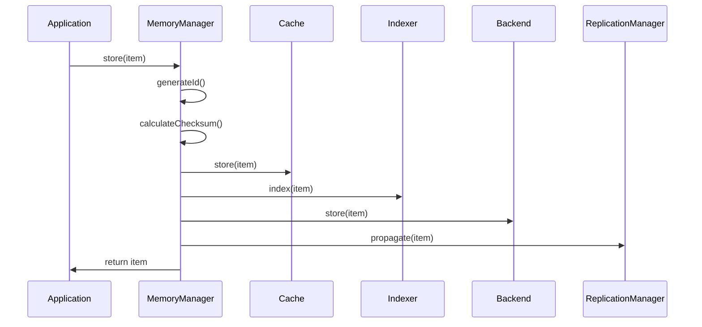
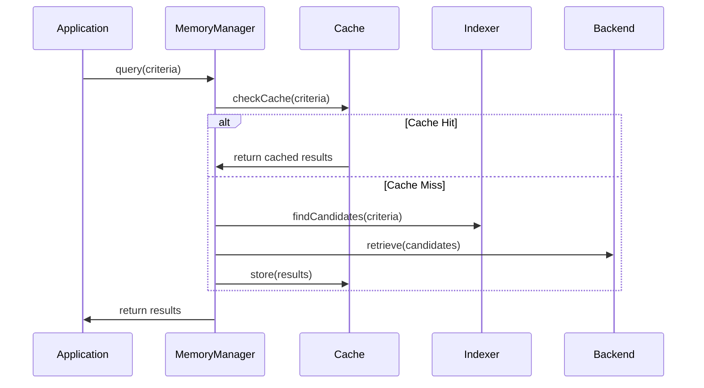

# Architecture Overview

## System Architecture

The SPARC Memory Bank follows a layered architecture designed for scalability, maintainability, and performance:

```
┌─────────────────────────────────────────────────────────────┐
│                     Application Layer                      │
├─────────────────────────────────────────────────────────────┤
│  Memory Manager  │  Namespace Manager  │  Replication Mgr  │
├─────────────────────────────────────────────────────────────┤
│     Cache Layer     │      Indexer      │   Import/Export   │
├─────────────────────────────────────────────────────────────┤
│        SQLite Backend        │      Markdown Backend        │
├─────────────────────────────────────────────────────────────┤
│              Storage Layer (File System/Database)           │
└─────────────────────────────────────────────────────────────┘
```

## Core Components

### Memory Manager

The central orchestrator that coordinates all memory operations:

```typescript
class MemoryManager {
  private backend: MemoryBackend;
  private cache: MemoryCache;
  private indexer: MemoryIndexer;
  private namespaceManager: NamespaceManager;
  private replicationManager: ReplicationManager;
  private config: MemoryConfig;

  // Core operations
  async store(item: Partial<MemoryItem>): Promise<MemoryItem>
  async retrieve(id: string): Promise<MemoryItem | null>
  async query(query: MemoryQuery): Promise<MemoryItem[]>
  async update(id: string, updates: Partial<MemoryItem>): Promise<MemoryItem>
  async delete(id: string): Promise<boolean>
}
```

**Key Responsibilities:**
- Coordinate operations across all subsystems
- Manage transactions and consistency
- Handle caching strategies
- Orchestrate replication and conflict resolution
- Provide unified API interface

### Storage Backends

#### SQLite Backend

**Optimizations:**
- WAL (Write-Ahead Logging) mode for concurrent access
- FTS5 full-text search with custom tokenizers
- Prepared statements for performance
- Connection pooling for concurrent operations
- Automatic vacuum and optimization

**Schema Design:**
```sql
CREATE TABLE memory_items (
  id TEXT PRIMARY KEY,
  category TEXT NOT NULL,
  content TEXT NOT NULL,
  tags TEXT, -- JSON array
  namespace TEXT,
  metadata TEXT, -- JSON object
  embedding BLOB, -- Vector data
  version INTEGER NOT NULL,
  vector_clock TEXT, -- JSON object
  created INTEGER NOT NULL,
  updated INTEGER NOT NULL,
  checksum TEXT NOT NULL
);

-- Indexes for optimal query performance
CREATE INDEX idx_category ON memory_items(category);
CREATE INDEX idx_namespace ON memory_items(namespace);
CREATE INDEX idx_created ON memory_items(created);
CREATE INDEX idx_updated ON memory_items(updated);

-- Full-text search virtual table
CREATE VIRTUAL TABLE memory_fts USING fts5(
  content,
  tags,
  content='memory_items',
  content_rowid='rowid'
);
```

#### Markdown Backend

**Directory Structure:**
```
memory/
├── namespaces/
│   ├── default/
│   │   ├── implementation/
│   │   │   ├── 2024/01/
│   │   │   │   ├── task-001.md
│   │   │   │   └── task-002.md
│   │   │   └── index.json
│   │   └── research/
│   └── project-x/
├── .meta/
│   ├── vector_clock.json
│   ├── checksums.json
│   └── indexes/
└── .gitignore
```

**File Format:**
```markdown
---
id: task-001
category: implementation
tags: [auth, security, backend]
namespace: default
version: 3
vectorClock:
  agent-1: 2
  agent-2: 1
created: 2024-01-15T10:30:00Z
updated: 2024-01-15T14:20:00Z
checksum: sha256:abc123...
metadata:
  assignee: alice
  priority: high
  completion: 0.8
---

# User Authentication Implementation

Implemented JWT-based authentication system with the following features:

- Token generation and validation
- Role-based access control
- Session management
- Password hashing with bcrypt

## Progress

- [x] JWT token service
- [x] Authentication middleware
- [x] User registration endpoint
- [ ] Password reset functionality
```

### Caching System

**Multi-Strategy Cache:**
```typescript
interface CacheEntry<T> {
  value: T;
  accessCount: number;
  lastAccessed: number;
  created: number;
  ttl?: number;
  size: number;
}

class MemoryCache {
  private strategies: {
    lru: LRUStrategy;
    lfu: LFUStrategy;
    fifo: FIFOStrategy;
    ttl: TTLStrategy;
  };

  private stats: {
    hits: number;
    misses: number;
    evictions: number;
    totalSize: number;
  };
}
```

**Cache Strategies:**
- **LRU (Least Recently Used)**: Evicts items not accessed recently
- **LFU (Least Frequently Used)**: Evicts items with lowest access count
- **FIFO (First In, First Out)**: Evicts oldest items first
- **TTL (Time To Live)**: Automatic expiration based on time

### Indexing System

**Multi-Dimensional Indexing:**
```typescript
class MemoryIndexer {
  private indexes: {
    category: Map<string, Set<string>>;
    tags: Map<string, Set<string>>;
    namespace: Map<string, Set<string>>;
    timestamp: TreeMap<number, Set<string>>;
    vector: VectorIndex;
  };

  private vectorIndex: {
    embeddings: Map<string, number[]>;
    index: HNSWIndex; // Hierarchical Navigable Small World
  };
}
```

**Vector Search Implementation:**
- HNSW (Hierarchical Navigable Small World) for efficient similarity search
- Cosine similarity for semantic matching
- Configurable embedding dimensions (default: 1536 for OpenAI)
- Batch processing for embedding generation

### Conflict Resolution (CRDT)

**Vector Clock Implementation:**
```typescript
interface VectorClock {
  [agentId: string]: number;
}

class ConflictResolver {
  // Determine if clock A happened before clock B
  happensBefore(clockA: VectorClock, clockB: VectorClock): boolean {
    let allLessOrEqual = true;
    let atLeastOneLess = false;

    for (const agent in clockB) {
      const a = clockA[agent] || 0;
      const b = clockB[agent] || 0;
      
      if (a > b) return false;
      if (a < b) atLeastOneLess = true;
    }

    return allLessOrEqual && atLeastOneLess;
  }

  // Merge concurrent updates
  merge(itemA: MemoryItem, itemB: MemoryItem): MemoryItem {
    // Custom merge strategies based on field types
    return {
      ...itemA,
      content: this.mergeContent(itemA.content, itemB.content),
      tags: this.mergeTags(itemA.tags, itemB.tags),
      metadata: this.mergeMetadata(itemA.metadata, itemB.metadata),
      version: Math.max(itemA.version, itemB.version) + 1,
      vectorClock: this.mergeVectorClocks(itemA.vectorClock, itemB.vectorClock),
      updated: new Date()
    };
  }
}
```

### Replication Manager

**Distributed Synchronization:**
```typescript
class ReplicationManager {
  private peers: Map<string, PeerConnection>;
  private conflictResolver: ConflictResolver;
  private syncStrategy: SyncStrategy;

  // Synchronization strategies
  private strategies: {
    immediate: ImmediateSyncStrategy;
    batched: BatchedSyncStrategy;
    scheduled: ScheduledSyncStrategy;
  };

  async syncWithPeer(peerId: string): Promise<SyncResult> {
    const peer = this.peers.get(peerId);
    const localState = await this.getLocalState();
    const remoteState = await peer.getState();
    
    return this.reconcile(localState, remoteState);
  }
}
```

### Namespace Management

**Multi-Tenant Isolation:**
```typescript
interface NamespaceConfig {
  id: string;
  name: string;
  description?: string;
  permissions: NamespacePermissions;
  quotas: NamespaceQuotas;
  encryption: EncryptionConfig;
  replication: ReplicationConfig;
}

interface NamespacePermissions {
  read: string[]; // Agent IDs
  write: string[];
  admin: string[];
  public: boolean;
}

class NamespaceManager {
  async createNamespace(config: NamespaceConfig): Promise<void>
  async deleteNamespace(id: string): Promise<void>
  async checkPermission(namespace: string, agent: string, action: string): Promise<boolean>
  async enforceQuotas(namespace: string): Promise<QuotaStatus>
}
```

## Data Flow

### Write Operation Flow



### Query Operation Flow



## Performance Characteristics

### Time Complexity

| Operation | SQLite Backend | Markdown Backend | Notes |
|-----------|---------------|------------------|-------|
| Store | O(log n) | O(1) | SQLite index updates |
| Retrieve by ID | O(1) | O(1) | Hash table lookup |
| Query by category | O(log n) | O(n) | Index vs scan |
| Full-text search | O(k log n) | O(n) | FTS5 vs grep |
| Vector search | O(k log n) | O(n) | HNSW vs linear |

### Space Complexity

- **SQLite**: ~1.5x original data size (indexes, metadata)
- **Markdown**: ~1.2x original data size (YAML frontmatter)
- **Cache**: Configurable, typically 10-20% of total data
- **Indexes**: ~30-50% of original data size

## Scalability Considerations

### Horizontal Scaling

- **Read Replicas**: Multiple read-only instances
- **Sharding**: Namespace-based partitioning
- **Load Balancing**: Round-robin or weighted routing

### Vertical Scaling

- **Memory**: Larger cache sizes improve performance
- **Storage**: SSD recommended for SQLite backend
- **CPU**: Multi-core benefits indexing and search operations

### Limits

- **SQLite**: ~281TB theoretical, ~140TB practical
- **Markdown**: Limited by filesystem (ext4: 16TB, NTFS: 256TB)
- **Vector Search**: ~10M vectors with reasonable performance
- **Concurrent Users**: ~1000 with proper connection pooling

## Security Architecture

### Encryption

- **At Rest**: AES-256 for sensitive data
- **In Transit**: TLS 1.3 for replication
- **Key Management**: PBKDF2 with salt for key derivation

### Access Control

- **Namespace-level**: Read/write/admin permissions
- **Item-level**: Optional fine-grained access control
- **Audit Logging**: All operations logged with agent ID

### Integrity

- **Checksums**: SHA-256 for data integrity
- **Digital Signatures**: Optional signing for critical data
- **Version Verification**: CRDT vector clocks prevent tampering