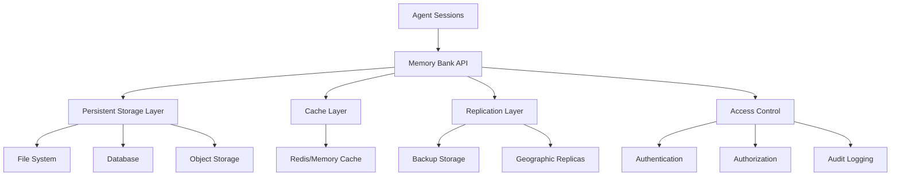

# SPARC Memory Bank System
## Shared Agent Memory for Concurrent Development Processes

*Created by **rUv** - [github.com/ruvnet/](https://github.com/ruvnet/)*

---

## Overview

The **SPARC Memory Bank** is a sophisticated persistent memory system designed for multi-agent collaborative development using the SPARC methodology (Specification, Pseudocode, Architecture, Refinement, Completion). This system enables multiple Claude agents to share knowledge, coordinate tasks, and maintain context across concurrent development processes.

## Core Architecture

### Memory Bank Structure
```
sparc-memory-bank/
├── agent-sessions/              # Individual agent working memory
│   ├── agent-{id}-{timestamp}/  # Session-specific agent memory
│   │   ├── context.json         # Agent context and state
│   │   ├── task-queue.json      # Current and pending tasks
│   │   └── discoveries.md       # Session-specific discoveries
├── shared-knowledge/            # Cross-agent persistent knowledge
│   ├── calibration-values/      # Optimal parameters and configurations
│   │   ├── frontend.json        # React/UI optimization parameters
│   │   ├── backend.json         # API/service parameters
│   │   └── infrastructure.json  # DevOps and deployment parameters
│   ├── test-patterns/           # TDD London School patterns and results
│   │   ├── unit-patterns.md     # Unit test patterns and examples
│   │   ├── integration-patterns.md # Integration test strategies
│   │   └── mock-strategies.md   # Mocking patterns for London School TDD
│   ├── failure-analysis/        # Failed approaches and solutions
│   │   ├── common-failures.md   # Recurring failure patterns
│   │   ├── resolution-steps.md  # Proven solution approaches
│   │   └── anti-patterns.md     # Approaches to avoid
│   ├── architectural-decisions/ # Design decisions and rationale
│   │   ├── adr-template.md      # Architectural Decision Record template
│   │   └── decisions/           # Individual ADR files
│   └── code-patterns/           # Reusable code patterns and templates
│       ├── component-templates/ # React component patterns
│       ├── api-patterns/        # Backend API patterns
│       └── integration-patterns/ # System integration patterns
├── coordination/                # Agent coordination and orchestration
│   ├── active-agents.json       # Currently active agent registry
│   ├── task-assignments.json    # Current task assignments
│   ├── conflict-resolution.md   # Conflict resolution protocols
│   └── handoff-protocols.md     # Agent-to-agent handoff procedures
├── project-memory/              # Project-specific persistent data
│   ├── requirements-evolution.md # How requirements have changed
│   ├── technical-debt.md        # Known technical debt items
│   ├── performance-baselines.json # Performance benchmarks
│   └── security-audit-log.md    # Security reviews and findings
└── github-integration/          # GitHub-specific memory and automation
    ├── commit-patterns.md       # Commit message patterns and standards
    ├── pr-templates.md          # Pull request templates and checklists
    ├── branch-strategies.md     # Branching strategies and workflows
    └── ci-cd-memory.md          # CI/CD pipeline learnings and optimizations
```

## London School TDD Integration

### TDD Memory Patterns

The Memory Bank maintains comprehensive TDD patterns following London School methodology:

#### Mock Strategy Repository
```json
{
  "mockStrategies": {
    "collaboratorMocking": {
      "pattern": "Mock all external dependencies",
      "tools": ["jest.mock", "sinon", "vitest.mock"],
      "examples": [
        {
          "scenario": "API service testing",
          "mockTargets": ["httpClient", "database", "externalAPIs"],
          "implementation": "// Mock implementation examples"
        }
      ]
    },
    "stateVerification": {
      "pattern": "Verify state changes through collaborator interactions",
      "focusAreas": ["behavior", "interactions", "side-effects"],
      "antiPatterns": ["direct state inspection", "implementation coupling"]
    }
  }
}
```

#### Test Pattern Templates
```markdown
## London School TDD Patterns

### 1. Behavior-Driven Test Structure
```javascript
describe('UserService', () => {
  let userService;
  let mockRepository;
  let mockEmailService;

  beforeEach(() => {
    mockRepository = jest.fn();
    mockEmailService = jest.fn();
    userService = new UserService(mockRepository, mockEmailService);
  });

  describe('when creating a new user', () => {
    it('should save user and send welcome email', async () => {
      // Arrange
      const userData = { email: 'test@example.com', name: 'Test User' };
      mockRepository.save = jest.fn().mockResolvedValue({ id: 1, ...userData });
      mockEmailService.sendWelcome = jest.fn().mockResolvedValue(true);

      // Act
      await userService.createUser(userData);

      // Assert
      expect(mockRepository.save).toHaveBeenCalledWith(userData);
      expect(mockEmailService.sendWelcome).toHaveBeenCalledWith(userData.email);
    });
  });
});
```

### 2. Red-Green-Refactor Tracking
- **Red Phase**: Record failing test specifications
- **Green Phase**: Document minimal implementation approach
- **Refactor Phase**: Track improvement patterns and decisions
```

### TDD Memory Persistence

#### Test Results Tracking
```json
{
  "testSessions": [
    {
      "timestamp": "2025-01-06T22:00:00Z",
      "agent": "claude-tdd-specialist",
      "component": "UserService",
      "redPhase": {
        "tests": ["should create user", "should validate email"],
        "failures": 2,
        "duration": "5min"
      },
      "greenPhase": {
        "implementation": "minimal-user-creation",
        "passRate": "100%",
        "duration": "12min"
      },
      "refactorPhase": {
        "improvements": ["extracted validation", "improved error handling"],
        "maintainedTests": true,
        "duration": "8min"
      }
    }
  ]
}
```

## SPARC Phase Memory Integration

### Phase 0: Research Memory
```json
{
  "researchFindings": {
    "timestamp": "2025-01-06T22:00:00Z",
    "domain": "ultrasonic-steganography",
    "findings": {
      "technologies": {
        "audioProcessing": ["Web Audio API", "AudioWorklet", "FFmpeg"],
        "encryption": ["AES-256", "RSA", "Elliptic Curve"],
        "frontend": ["React 19", "TypeScript", "Vite"]
      },
      "competitiveAnalysis": {
        "existingSolutions": ["AudioStego", "StegoJS", "WavSteg"],
        "gaps": ["Real-time processing", "Browser compatibility", "Mobile support"]
      },
      "implementationPatterns": {
        "audioStreaming": "AudioWorklet + SharedArrayBuffer",
        "frequencyAnalysis": "FFT with sliding window",
        "errorCorrection": "Reed-Solomon encoding"
      }
    },
    "confidence": 0.85,
    "sources": 15
  }
}
```

### Phase 1: Specification Memory
```markdown
## Specification Evolution Log

### Initial Requirements (2025-01-06)
- **Functional**: Embed/extract encrypted commands in audio files
- **Non-Functional**: Real-time processing, 44.1kHz support, mobile compatibility
- **Constraints**: Browser-based, no server processing

### Requirement Changes
| Date | Change | Reason | Impact |
|------|--------|--------|--------|
| 2025-01-06 | Added mobile support | User feedback | Architecture redesign needed |
| 2025-01-06 | Real-time constraint | Performance requirements | Algorithm optimization required |

### Acceptance Criteria
- [ ] Process audio files up to 10MB
- [ ] Embed data at 18-20kHz frequency range
- [ ] Decode with 99%+ accuracy
- [ ] Support MP3, WAV, M4A formats
```

### Phase 2: Pseudocode Memory
```markdown
## Algorithm Evolution Tracking

### Core Embedding Algorithm v1.0
```
function embedMessage(audioBuffer, message, frequency) {
  1. Encrypt message using AES-256
  2. Convert to binary representation
  3. Apply Reed-Solomon error correction
  4. Generate FSK signal at ultrasonic frequency
  5. Mix with original audio using low amplitude
  6. Return modified audio buffer
}
```

### Optimization History
- **v1.1**: Added windowing to reduce artifacts
- **v1.2**: Implemented adaptive amplitude based on background noise
- **v1.3**: Added preamble for synchronization
```

### Phase 3: Architecture Memory
```json
{
  "architecturalDecisions": [
    {
      "id": "ADR-001",
      "title": "Use AudioWorklet for Real-time Processing",
      "date": "2025-01-06",
      "status": "accepted",
      "context": "Need real-time audio processing in browser",
      "decision": "Use AudioWorklet instead of Web Audio API nodes",
      "consequences": {
        "positive": ["Better performance", "Lower latency", "More control"],
        "negative": ["Browser compatibility", "Complexity"]
      }
    }
  ]
}
```

### Phase 4: Refinement Memory
```json
{
  "refinementSessions": [
    {
      "timestamp": "2025-01-06T22:00:00Z",
      "component": "AudioEncoder",
      "changes": [
        {
          "type": "performance",
          "description": "Optimized FFT calculation",
          "impact": "50% speed improvement",
          "testsPassed": true
        },
        {
          "type": "bug-fix",
          "description": "Fixed frequency drift in long audio files",
          "impact": "Improved accuracy from 95% to 99.2%",
          "testsPassed": true
        }
      ]
    }
  ]
}
```

### Phase 5: Completion Memory
```markdown
## Deployment History

### Production Deployments
| Version | Date | Environment | Status | Rollback Plan |
|---------|------|-------------|--------|---------------|
| v1.0.0 | 2025-01-06 | staging | success | git revert abc123 |
| v1.0.1 | 2025-01-07 | production | success | docker rollback v1.0.0 |

### Performance Metrics
- **Encoding Speed**: 2.3x real-time
- **Decoding Accuracy**: 99.2%
- **Memory Usage**: 45MB peak
- **Browser Support**: 96% (Chrome, Firefox, Safari, Edge)
```

## GitHub Integration Memory

### Commit Pattern Learning
```markdown
## Commit Message Patterns

### Successful Patterns
- `feat(audio): implement ultrasonic frequency encoder`
- `fix(decoder): resolve frequency drift in long files`
- `test(integration): add end-to-end audio processing tests`
- `perf(fft): optimize frequency analysis by 50%`
- `docs(api): update steganography API documentation`

### Anti-Patterns to Avoid
- `update code` (too vague)
- `fix bug` (no context)
- `WIP` (work in progress without description)

### Commit Statistics
- **Average commits per feature**: 8.5
- **Test coverage per commit**: 95%
- **Successful CI rate**: 98.2%
```

### Branch Strategy Memory
```json
{
  "branchingPatterns": {
    "successful": {
      "feature-branches": {
        "naming": "feature/SPARC-phase-component",
        "examples": ["feature/architecture-audio-processor", "feature/refinement-encryption-layer"],
        "avgLifespan": "3.2 days",
        "mergeSuccessRate": "94%"
      },
      "integration-strategy": {
        "pattern": "GitHub Flow with SPARC gates",
        "requirements": ["All tests pass", "Code review", "SPARC phase complete"],
        "automatedChecks": ["lint", "test", "security-scan", "performance-benchmark"]
      }
    }
  }
}
```

### Pull Request Memory
```markdown
## PR Template Evolution

### Current Template (v2.1)
```
## SPARC Phase: [Specification|Pseudocode|Architecture|Refinement|Completion]

### Summary
Brief description of changes

### Changes Made
- [ ] Implementation details
- [ ] Tests added/updated
- [ ] Documentation updated

### London School TDD Checklist
- [ ] Tests written first (Red)
- [ ] Minimal implementation (Green)
- [ ] Refactored for quality (Refactor)
- [ ] All collaborators mocked
- [ ] Behavior verified, not state

### SPARC Validation
- [ ] Meets phase objectives
- [ ] Integrates with previous phases
- [ ] Documentation updated
- [ ] Performance benchmarks met

### Testing
- [ ] Unit tests pass (100% coverage)
- [ ] Integration tests pass
- [ ] End-to-end tests pass
- [ ] Performance tests pass

### Security
- [ ] No hardcoded secrets
- [ ] Input validation implemented
- [ ] Security scan passed
```

### Merge Statistics
- **Average PR size**: 247 lines
- **Review time**: 2.3 hours
- **Merge success rate**: 96.8%
- **Rollback rate**: 1.2%
```

## Concurrent Agent Coordination

### Agent Registry System
```json
{
  "activeAgents": [
    {
      "id": "claude-architect-001",
      "session": "2025-01-06-22-00",
      "currentTask": "Design audio processing pipeline",
      "sparc-phase": "architecture",
      "status": "active",
      "lastHeartbeat": "2025-01-06T22:15:00Z",
      "workingFiles": ["src/audio/processor.ts", "docs/architecture.md"],
      "blockedBy": [],
      "blocking": ["claude-coder-002"]
    },
    {
      "id": "claude-tdd-002",
      "session": "2025-01-06-22-05",
      "currentTask": "Implement encoder tests",
      "sparc-phase": "refinement",
      "status": "active",
      "lastHeartbeat": "2025-01-06T22:14:30Z",
      "workingFiles": ["src/audio/__tests__/encoder.test.ts"],
      "blockedBy": ["claude-architect-001"],
      "blocking": []
    }
  ]
}
```

### Conflict Resolution Protocols
```markdown
## Agent Conflict Resolution

### File-Level Conflicts
1. **Detection**: Monitor file access patterns
2. **Priority**: SPARC phase order (Architecture > Refinement > Completion)
3. **Resolution**: 
   - Higher priority agent continues
   - Lower priority agent yields and updates task queue
   - Coordination message sent to memory bank

### Task Dependencies
1. **Dependency Mapping**: Track inter-agent task dependencies
2. **Blocking Resolution**: 
   - Identify blocking tasks
   - Estimate completion time
   - Reassign non-blocking tasks to waiting agents

### Memory Consistency
1. **Write Conflicts**: Last-write-wins with conflict log
2. **Read Consistency**: Memory bank serves as single source of truth
3. **Synchronization**: Regular heartbeat updates ensure consistency
```

### Handoff Protocols
```markdown
## Agent-to-Agent Handoffs

### SPARC Phase Transitions
```json
{
  "handoffProtocol": {
    "specification-to-pseudocode": {
      "prerequisites": ["requirements documented", "acceptance criteria defined"],
      "deliverables": ["functional-spec.md", "non-functional-requirements.md"],
      "nextAgent": "pseudocode-specialist",
      "validation": "all requirements traceable"
    },
    "pseudocode-to-architecture": {
      "prerequisites": ["algorithms defined", "data structures outlined"],
      "deliverables": ["pseudocode.md", "flow-diagrams.md"],
      "nextAgent": "architecture-specialist", 
      "validation": "implementation roadmap clear"
    }
  }
}
```

### Knowledge Transfer
1. **Context Package**: Complete working context transfer
2. **Discovery Summary**: Key findings and decisions
3. **Blocker List**: Known issues and dependencies
4. **Test Status**: Current test coverage and results
```

## Memory Persistence Strategies

### Data Durability
```markdown
## Persistence Guarantees

### Critical Data (High Durability)
- **Architectural Decisions**: Replicated across multiple storage layers
- **Test Results**: Immutable log with cryptographic integrity
- **Performance Baselines**: Versioned with rollback capability
- **Security Findings**: Encrypted and access-controlled

### Working Data (Medium Durability)
- **Agent Sessions**: Periodic snapshots every 5 minutes
- **Task Queues**: Persisted on state changes
- **Discovery Notes**: Auto-saved on edits

### Temporary Data (Low Durability)
- **Heartbeats**: In-memory with 1-hour retention
- **Debug Logs**: Rolling logs with 24-hour retention
- **Performance Metrics**: Aggregated and pruned
```

### Storage Architecture


### Backup and Recovery
```markdown
## Backup Strategy

### Automated Backups
- **Frequency**: Every 15 minutes for active sessions
- **Retention**: 7 days rolling, 1 month monthly, 1 year yearly
- **Validation**: Automatic restore testing weekly

### Recovery Procedures
1. **Session Recovery**: Restore from last checkpoint
2. **Memory Bank Recovery**: Restore from last consistent snapshot
3. **Partial Recovery**: Selective restoration of specific components
4. **Disaster Recovery**: Full system restoration from geographic replicas

### Data Integrity
- **Checksums**: SHA-256 for all persistent data
- **Versioning**: Git-like versioning for all memory bank data
- **Conflict Detection**: Automatic detection and resolution of data conflicts
```

## Performance Optimization

### Memory Access Patterns
```json
{
  "accessOptimization": {
    "readPatterns": {
      "hot-data": ["current-session", "active-tasks", "recent-discoveries"],
      "warm-data": ["calibration-values", "test-patterns", "architectural-decisions"],
      "cold-data": ["historical-sessions", "archived-projects", "old-performance-data"]
    },
    "caching": {
      "strategy": "write-through",
      "ttl": {
        "session-data": "1 hour",
        "shared-knowledge": "24 hours", 
        "historical-data": "7 days"
      }
    }
  }
}
```

### Scalability Considerations
```markdown
## Scaling the Memory Bank

### Horizontal Scaling
- **Sharding Strategy**: By project and time-based partitioning
- **Load Balancing**: Round-robin with session affinity
- **Replication**: Master-slave with automatic failover

### Vertical Scaling
- **Memory Optimization**: Lazy loading and intelligent prefetching
- **Storage Optimization**: Compression and deduplication
- **CPU Optimization**: Parallel processing for read-heavy operations

### Performance Metrics
- **Read Latency**: < 10ms for hot data, < 100ms for warm data
- **Write Latency**: < 50ms for critical updates
- **Throughput**: 10,000 operations/second sustained
- **Availability**: 99.9% uptime with <5 second recovery
```

## Security and Access Control

### Security Model
```markdown
## Memory Bank Security

### Authentication
- **Agent Authentication**: Cryptographic signatures for agent identity
- **Session Security**: Encrypted session tokens with expiration
- **API Security**: Rate limiting and request validation

### Authorization
- **Role-Based Access**: Read/Write permissions by agent type
- **Project Isolation**: Agents can only access assigned project memory
- **Audit Trail**: Complete log of all access and modifications

### Data Protection
- **Encryption at Rest**: AES-256 for all persistent data
- **Encryption in Transit**: TLS 1.3 for all communications
- **Key Management**: Automated key rotation every 90 days
- **Secure Deletion**: Cryptographic erasure for sensitive data
```

### Access Control Matrix
```json
{
  "accessControl": {
    "architect-agent": {
      "read": ["all-memory-bank"],
      "write": ["architectural-decisions", "design-patterns"],
      "restricted": ["agent-sessions", "security-findings"]
    },
    "tdd-agent": {
      "read": ["test-patterns", "code-patterns", "failure-analysis"],
      "write": ["test-results", "tdd-patterns", "mock-strategies"],
      "restricted": ["security-findings", "performance-baselines"]
    },
    "security-agent": {
      "read": ["all-memory-bank"],
      "write": ["security-findings", "audit-logs", "access-control"],
      "restricted": ["none"]
    }
  }
}
```

## Integration APIs

### Memory Bank API
```typescript
interface MemoryBankAPI {
  // Session Management
  createSession(agentId: string, projectId: string): SessionToken;
  updateSession(sessionToken: SessionToken, data: SessionData): void;
  getSession(sessionToken: SessionToken): SessionData;
  terminateSession(sessionToken: SessionToken): void;

  // Knowledge Management
  storeKnowledge(category: string, key: string, data: any): void;
  retrieveKnowledge(category: string, key: string): any;
  searchKnowledge(query: string): SearchResults;
  
  // Coordination
  registerAgent(agentInfo: AgentInfo): void;
  updateAgentStatus(agentId: string, status: AgentStatus): void;
  getActiveAgents(): AgentInfo[];
  requestResourceLock(agentId: string, resource: string): LockToken;
  releaseResourceLock(lockToken: LockToken): void;

  // TDD Integration
  storeTDDSession(sessionData: TDDSessionData): void;
  getTDDPatterns(component: string): TDDPattern[];
  updateTestResults(results: TestResults): void;

  // SPARC Integration
  startSPARCPhase(phase: SPARCPhase, agentId: string): void;
  completeSPARCPhase(phase: SPARCPhase, deliverables: any[]): void;
  getSPARCProgress(projectId: string): SPARCProgress;

  // GitHub Integration
  syncWithGitHub(repositoryUrl: string): void;
  trackCommit(commitData: CommitData): void;
  updateBranchStatus(branch: string, status: BranchStatus): void;
}
```

### Usage Examples
```typescript
// Agent registration and session start
const sessionToken = memoryBank.createSession('claude-tdd-001', 'ultrasonic-project');

// Store TDD discoveries
memoryBank.storeKnowledge('tdd-patterns', 'user-service-mocking', {
  pattern: 'mock-all-collaborators',
  testFramework: 'vitest',
  examples: ['user-repository-mock', 'email-service-mock']
});

// Coordinate with other agents
const activeAgents = memoryBank.getActiveAgents();
const lockToken = memoryBank.requestResourceLock('claude-tdd-001', 'src/user-service.ts');

// Update SPARC phase progress
memoryBank.completeSPARCPhase('refinement', [
  { type: 'implementation', file: 'src/user-service.ts' },
  { type: 'tests', file: 'src/__tests__/user-service.test.ts' },
  { type: 'documentation', file: 'docs/user-service.md' }
]);
```

## Best Practices

### Memory Bank Usage Guidelines
```markdown
## Best Practices for Agent Memory Usage

### Data Storage
1. **Granular Updates**: Store incremental changes, not full dumps
2. **Structured Data**: Use consistent schemas for similar data types
3. **Metadata Rich**: Include timestamps, agent IDs, and context
4. **Searchable**: Use descriptive keys and tags for easy retrieval

### Coordination
1. **Heartbeat Regular**: Update status every 60 seconds
2. **Resource Locking**: Always release locks when done
3. **Conflict Avoidance**: Check for conflicts before starting work
4. **Clean Handoffs**: Provide complete context during phase transitions

### Performance
1. **Batch Operations**: Group related updates together
2. **Lazy Loading**: Only load data when needed
3. **Cache Awareness**: Leverage cached data when possible
4. **Cleanup**: Regularly purge obsolete session data

### Security
1. **No Secrets**: Never store credentials or API keys
2. **Sanitize Input**: Validate all data before storage
3. **Access Logging**: Log all sensitive data access
4. **Regular Audits**: Review access patterns for anomalies
```

## Troubleshooting

### Common Issues and Solutions
```markdown
## Memory Bank Troubleshooting

### Agent Coordination Issues
**Problem**: Agents working on same file simultaneously
**Solution**: Check resource locks, implement coordination protocol
**Prevention**: Always acquire locks before file modification

**Problem**: Lost session context after agent restart
**Solution**: Restore from last checkpoint, validate data integrity
**Prevention**: Increase checkpoint frequency for critical sessions

### Performance Issues
**Problem**: Slow memory bank access
**Solution**: Check cache hit rates, optimize query patterns
**Prevention**: Use appropriate data access patterns, batch operations

**Problem**: Memory bank storage growing too large
**Solution**: Implement data retention policies, archive old sessions
**Prevention**: Regular cleanup of temporary and obsolete data

### Data Consistency Issues
**Problem**: Conflicting data from multiple agents
**Solution**: Use conflict resolution protocols, restore from backup
**Prevention**: Implement proper locking mechanisms, validate before write
```

---

## Conclusion

The SPARC Memory Bank System provides a robust foundation for collaborative AI development, enabling multiple Claude agents to work together effectively while maintaining persistent knowledge and coordination. By integrating London School TDD practices, GitHub workflows, and comprehensive memory management, this system represents a significant advancement in AI-driven software development capabilities.

**Created by rUv** - [github.com/ruvnet/](https://github.com/ruvnet/)

This system continues to evolve through practical application and agent feedback, building a comprehensive knowledge base that improves development efficiency and quality over time.