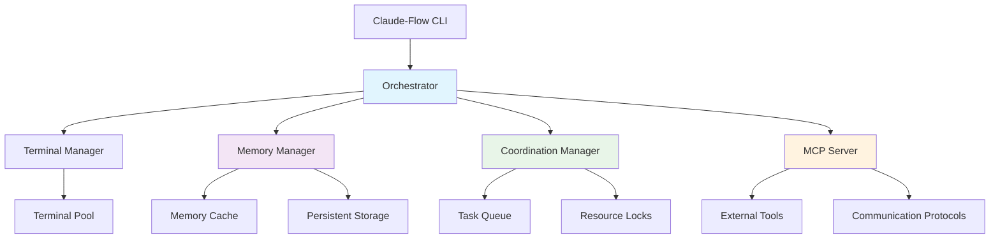
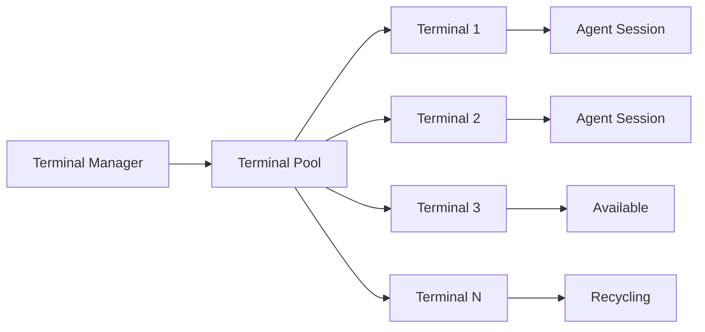
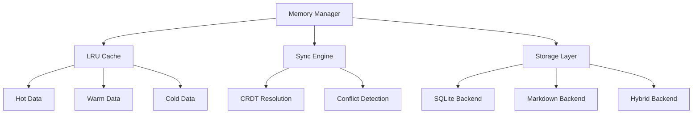
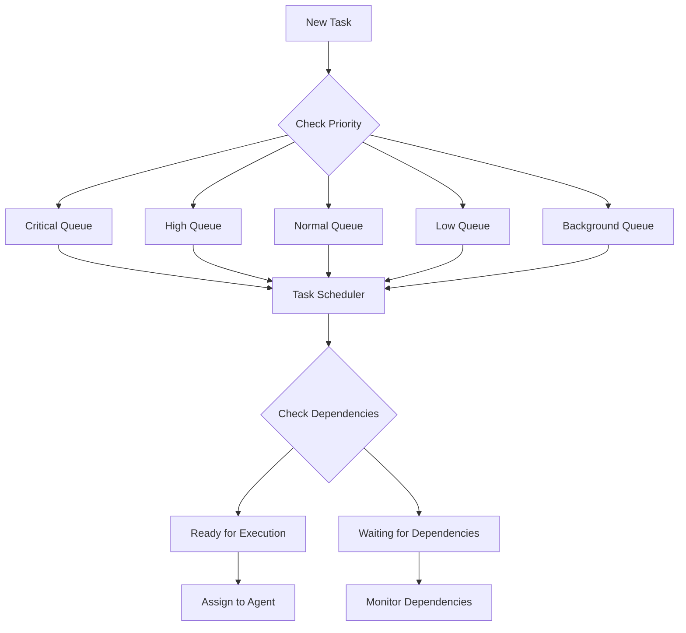
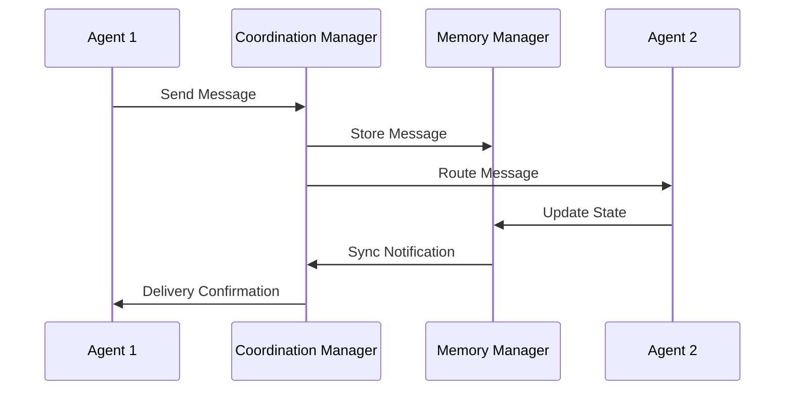
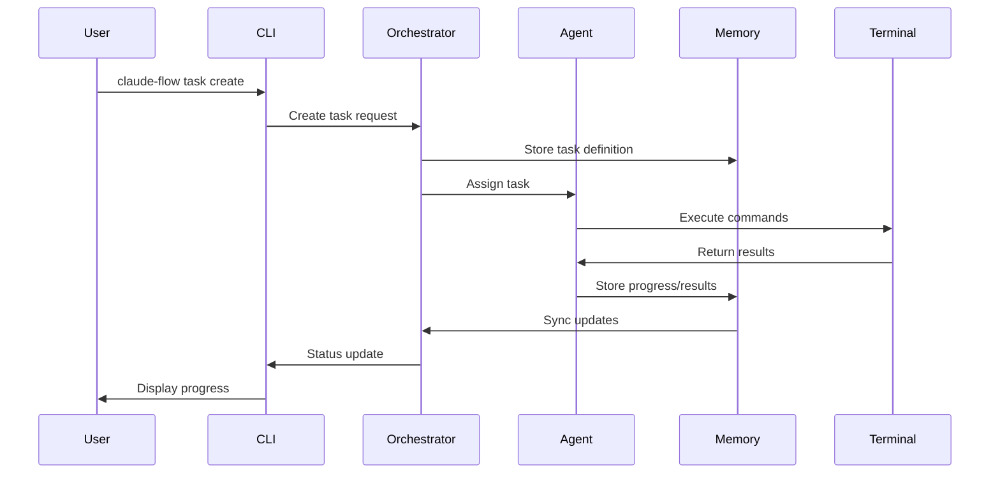
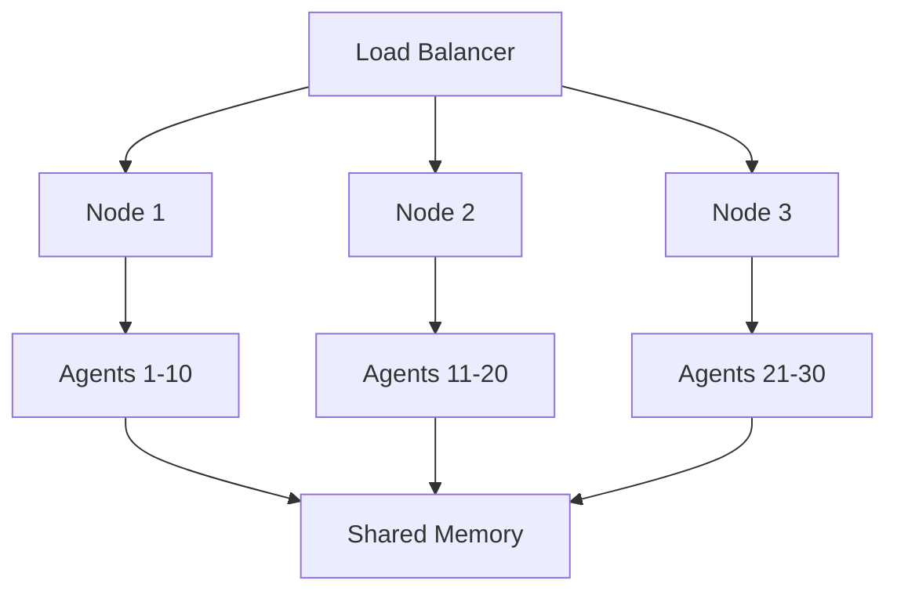
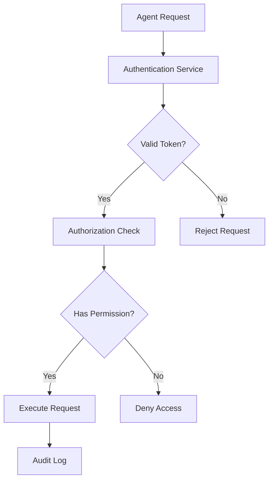

# Architecture Overview

Claude-Flow implements a sophisticated multi-layered architecture designed for scalability, reliability, and extensibility. This document provides a comprehensive overview of the system components and their interactions.

## High-Level Architecture



## Core Components

### 1. Orchestrator (Central Coordinator)

The orchestrator serves as the central command and control system for all Claude-Flow operations.

**Key Responsibilities:**
- **Agent Lifecycle Management**: Spawning, monitoring, and terminating agents
- **Resource Allocation**: Distributing system resources across active agents
- **Health Monitoring**: Continuous system health checks and recovery
- **Service Coordination**: Managing interactions between all system components

**Architecture Details:**
```typescript
interface Orchestrator {
  agentManager: AgentManager;
  resourceManager: ResourceManager;
  healthMonitor: HealthMonitor;
  serviceRegistry: ServiceRegistry;
  
  spawnAgent(config: AgentConfig): Promise<AgentSession>;
  terminateAgent(agentId: string): Promise<void>;
  allocateResources(request: ResourceRequest): Promise<ResourceAllocation>;
  monitorHealth(): HealthStatus;
}
```

### 2. Terminal Manager (Session Control)

Handles all terminal-related operations with advanced pooling and session management.

**Key Features:**
- **Pool Management**: Maintains a configurable pool of reusable terminal sessions
- **Session Recycling**: Automatically recycles terminals after configurable usage
- **Command Execution**: Secure command execution with timeout handling
- **Cross-Platform Support**: Works across Windows, macOS, and Linux

**Pool Architecture:**


**Configuration Options:**
- Pool size (default: 5 terminals)
- Recycling threshold (default: 10 commands)
- Health check interval (default: 60 seconds)
- Command timeout (default: 5 minutes)

### 3. Memory Manager (Persistent State)

Provides hybrid memory storage with multiple backends and intelligent caching.

**Storage Backends:**
- **SQLite**: Structured data, queries, and indexes
- **Markdown**: Documentation and human-readable content
- **Hybrid**: Combines both for optimal performance

**Key Features:**
- **CRDT Conflict Resolution**: Handles concurrent updates from multiple agents
- **Intelligent Caching**: LRU caching with configurable size limits
- **Data Synchronization**: Real-time synchronization across all agents
- **Compression**: Optional data compression for storage efficiency

**Memory Architecture:**


### 4. Coordination Manager (Task Orchestration)

Manages complex task workflows and agent coordination with advanced scheduling.

**Core Features:**
- **Priority-Based Scheduling**: Advanced task queue with 5 priority levels
- **Dependency Management**: Handles complex task dependencies and chains
- **Deadlock Detection**: Automatic detection and resolution of resource deadlocks
- **Load Balancing**: Intelligent distribution of tasks across available agents

**Scheduling Algorithm:**


### 5. MCP Server (Tool Integration)

Implements Model Context Protocol for external tool integration and communication.

**Transport Protocols:**
- **Stdio**: Standard input/output for local tools
- **HTTP**: RESTful API for remote services
- **WebSocket**: Real-time bidirectional communication

**Security Features:**
- **TLS Encryption**: Optional TLS for remote connections
- **Authentication**: Token-based authentication
- **Authorization**: Role-based access control
- **Audit Logging**: Comprehensive security auditing

## Data Flow Architecture

### Agent-to-Agent Communication



### Task Execution Flow



## Communication Patterns

Claude-Flow supports multiple communication patterns between agents:

### 1. Direct Communication
Agents can send messages directly to specific agents:
```bash
claude-flow agent message <target-agent-id> "Please prioritize API implementation"
```

### 2. Broadcast Communication
Agents can broadcast information to all active agents:
```bash
claude-flow agent broadcast "System maintenance scheduled in 30 minutes"
```

### 3. Pub/Sub Pattern
Agents can subscribe to specific event types or topics:
```json
{
  "agent": "researcher-001",
  "subscriptions": [
    "research-updates",
    "task-assignments",
    "system-alerts"
  ]
}
```

### 4. Shared Memory
Agents access shared state through the memory manager:
```bash
# Agent writes discovery
claude-flow memory store --type "discovery" --content "Found optimal algorithm"

# Other agents can query
claude-flow memory query --type "discovery" --recent
```

## Scalability Design

### Horizontal Scaling

**Agent Distribution:**


**Configuration for Scaling:**
```json
{
  "scalability": {
    "horizontalScaling": {
      "enabled": true,
      "minInstances": 2,
      "maxInstances": 20,
      "scaleUpThreshold": {
        "cpu": "70%",
        "memory": "80%",
        "queueLength": 50
      }
    }
  }
}
```

### Vertical Scaling

**Resource Management:**
- Dynamic memory allocation based on workload
- CPU limit adjustment for intensive tasks
- Storage scaling for memory-heavy operations

## Security Architecture

### Authentication Flow


### Security Layers
1. **Network Security**: TLS encryption for all communications
2. **Authentication**: Token-based agent authentication
3. **Authorization**: Role-based access control (RBAC)
4. **Data Protection**: Encryption at rest and in transit
5. **Audit Logging**: Comprehensive security event logging

## Performance Characteristics

### Latency Targets
- **Agent spawn time**: < 500ms
- **Task assignment**: < 100ms
- **Memory operations**: < 50ms (cache hit), < 200ms (cache miss)
- **Terminal command execution**: < 5s (default timeout)
- **Inter-agent messaging**: < 100ms

### Throughput Capabilities
- **Concurrent agents**: Up to 50 per instance (configurable)
- **Task queue**: 1000+ tasks in queue
- **Memory operations**: 10,000+ ops/second
- **Terminal commands**: 100+ concurrent executions

### Resource Usage
- **Memory overhead**: ~50MB base + 10MB per agent
- **CPU usage**: ~5% idle, scales with active tasks
- **Storage**: Configurable, with compression support
- **Network**: Minimal for local operations, scales with remote tools

## Monitoring and Observability

### Built-in Metrics
```json
{
  "orchestrator": {
    "activeAgents": 5,
    "queuedTasks": 12,
    "systemHealth": "healthy"
  },
  "memory": {
    "cacheHitRate": 0.85,
    "storageUsage": "2.3GB",
    "syncLatency": "45ms"
  },
  "terminals": {
    "poolUtilization": 0.6,
    "avgCommandTime": "2.1s",
    "failureRate": 0.02
  }
}
```

### Health Checks
- **Component health**: Individual service health monitoring
- **Agent health**: Agent responsiveness and resource usage
- **System health**: Overall system performance metrics
- **Dependency health**: External service availability

## Extension Points

### Custom Agent Types
```typescript
interface CustomAgentType {
  name: string;
  capabilities: string[];
  tools: string[];
  memory: MemoryConfig;
  performance: PerformanceConfig;
}
```

### Plugin Architecture
- **Tool plugins**: Custom MCP tools
- **Storage plugins**: Custom storage backends
- **Communication plugins**: Custom messaging protocols
- **Monitoring plugins**: Custom metrics and alerts

### API Extensions
- **RESTful API**: For external system integration
- **WebSocket API**: For real-time updates
- **GraphQL API**: For complex queries and subscriptions

This architecture provides a robust foundation for sophisticated AI agent orchestration while maintaining flexibility for extension and customization.