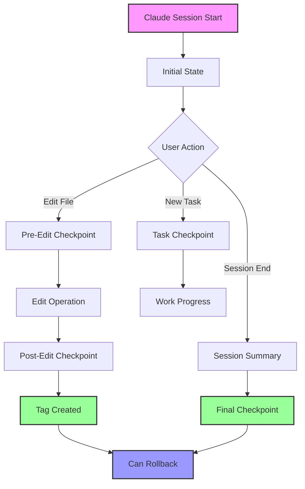

# Git Checkpoint System - Visual Guide

## 🔄 Checkpoint Workflow



## 📊 Checkpoint Timeline Example

```
Timeline of a typical Claude session:

09:00 ─┬─ Session Start
       │  └─ checkpoint-initial-20240130-090000
       │
09:05 ─┼─ Task: "Add user authentication"
       │  └─ task-20240130-090500
       │
09:10 ─┼─ Pre-Edit: src/auth.js
       │  └─ checkpoint/pre-edit-20240130-091000
       │
09:12 ─┼─ Post-Edit: src/auth.js
       │  └─ checkpoint-20240130-091200 (tag)
       │
09:20 ─┼─ Pre-Edit: tests/auth.test.js
       │  └─ checkpoint/pre-edit-20240130-092000
       │
09:25 ─┼─ Post-Edit: tests/auth.test.js
       │  └─ checkpoint-20240130-092500 (tag)
       │
09:30 ─┼─ Session End
       │  └─ session-end-20240130-093000
       │  └─ Summary: .claude/checkpoints/summary-*.md
       ┴
```

## 🎯 Checkpoint Types

### 1. Pre-Edit Checkpoints (Branches)
```bash
checkpoint/pre-edit-20240130-091000
```
- Created BEFORE file modifications
- Stored as Git branches
- Allows comparison of before/after states
- Non-destructive (uses git stash)

### 2. Post-Edit Checkpoints (Tags)
```bash
checkpoint-20240130-091200
```
- Created AFTER successful edits
- Stored as Git tags
- Includes commit with changes
- Easy to reference and rollback

### 3. Task Checkpoints
```bash
task-20240130-090500
```
- Created when new tasks are submitted
- Captures project state at task start
- Includes task description in commit

### 4. Session Checkpoints
```bash
session-end-20240130-093000
```
- Created at session end
- Includes summary of all changes
- Final snapshot of work

## 🔧 Rollback Scenarios

### Scenario 1: Undo Last Edit
```bash
# You edited src/app.js but want to revert
git checkout checkpoint-20240130-143022 -- src/app.js
```

### Scenario 2: Return to Task Start
```bash
# Reset to beginning of "Add authentication" task
git reset --hard task-20240130-090500
```

### Scenario 3: Compare Changes
```bash
# See all changes since morning checkpoint
git diff checkpoint-20240130-090000
```

### Scenario 4: Safe Exploration
```bash
# Create branch from checkpoint to try something
git checkout -b experiment checkpoint-20240130-143022
```

## 📁 File Structure

```
.claude/
├── settings.json                    # Active hooks configuration
├── checkpoints/
│   ├── 1706612400.json             # Pre-edit metadata
│   ├── 1706612520.json             # Post-edit metadata
│   ├── task-1706612300.json        # Task metadata
│   └── summary-session-*.md        # Session summaries
└── helpers/
    ├── checkpoint-hooks.sh         # Hook implementation
    ├── checkpoint-manager.sh       # Management utility
    └── setup-checkpoints.sh        # Quick setup

.git/
├── refs/
│   ├── heads/
│   │   └── checkpoint/*           # Pre-edit branches
│   └── tags/
│       ├── checkpoint-*           # Post-edit tags
│       ├── task-*                 # Task tags
│       └── session-end-*          # Session tags
```

## 🛡️ Safety Features

1. **Non-Destructive**: All checkpoints preserve history
2. **Automatic**: No manual intervention needed
3. **Metadata Tracking**: JSON files track context
4. **Multiple Rollback Options**: Branch, reset, or stash
5. **Session Summaries**: Easy review of changes

## 💡 Pro Tips

### Enable Verbose Output
```bash
export CHECKPOINT_VERBOSE=true
```

### Custom Tag Prefix
```bash
export CHECKPOINT_PREFIX="myproject"
# Creates: myproject-20240130-143022
```

### GitHub Integration
```bash
export CREATE_GH_RELEASE=true
# Creates GitHub releases for major checkpoints
```

### Quick Rollback Alias
```bash
alias rollback='~/.claude/helpers/checkpoint-manager.sh rollback'
# Usage: rollback checkpoint-20240130-143022
```

## 🚨 Important Notes

1. **Git Required**: System requires Git to be initialized
2. **jq Dependency**: JSON processing requires jq installed
3. **Clean Working Directory**: Best results with committed changes
4. **Storage**: Checkpoints use minimal space (only diffs stored)
5. **Cleanup**: Use checkpoint-manager.sh to remove old checkpoints