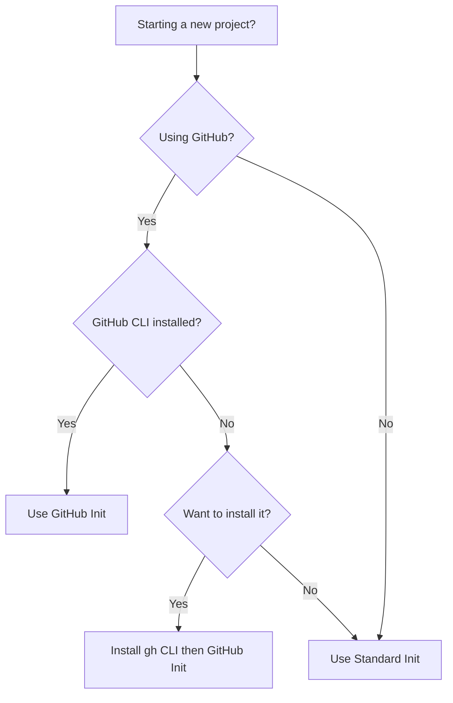

# Claude Flow Init Commands Summary

## Quick Reference

### Standard Init (Default)
```bash
npx claude-flow@alpha init
```
- ✅ Local Git checkpoints
- ✅ Automatic file edit tracking
- ✅ Session summaries
- ❌ No GitHub releases
- ❌ No GitHub CLI required

### GitHub-Enhanced Init
```bash
npx claude-flow@alpha github init
```
- ✅ Everything from standard init
- ✅ GitHub releases for checkpoints
- ✅ Team checkpoint sharing
- ✅ Enhanced rollback features
- ⚠️ Requires GitHub CLI

## Feature Comparison

| Feature | Standard Init | GitHub Init |
|---------|--------------|-------------|
| Git checkpoints | ✅ | ✅ |
| Automatic tracking | ✅ | ✅ |
| Session summaries | ✅ | ✅ |
| Checkpoint manager | ✅ | ✅ |
| GitHub releases | ❌ | ✅ |
| Team sharing | ❌ | ✅ |
| gh CLI required | ❌ | ✅ |
| Permissions | Basic Git | Git + GitHub |

## Which Should You Use?



## Commands Added to .claude/settings.json

### Standard Init Permissions
```json
"Bash(git tag *)",
"Bash(git branch *)", 
"Bash(git checkout *)",
"Bash(git stash *)",
"Bash(jq *)"
```

### GitHub Init Additional Permissions
```json
"Bash(gh release *)",
"Bash(gh pr *)",
"Bash(gh issue *)",
"Bash(gh workflow *)",
"Bash(gh repo *)",
"Bash(gh api *)"
```