# Agentic-Flow Architecture Diagrams

## System Overview

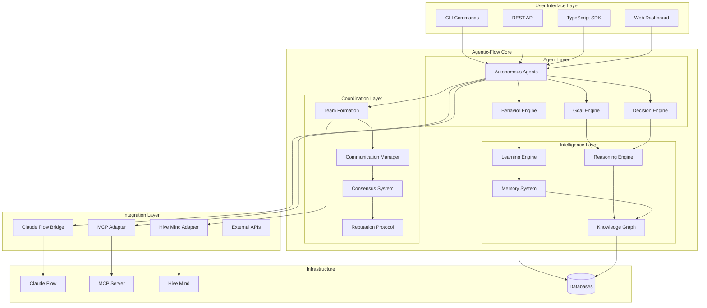

## Agent Architecture

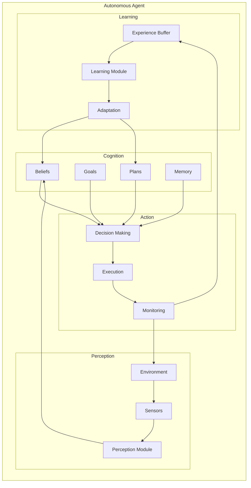

## Goal Decomposition Flow

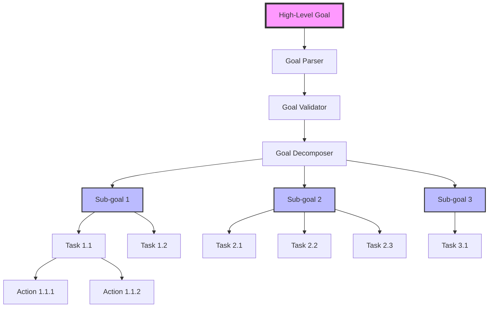

## Team Formation Process

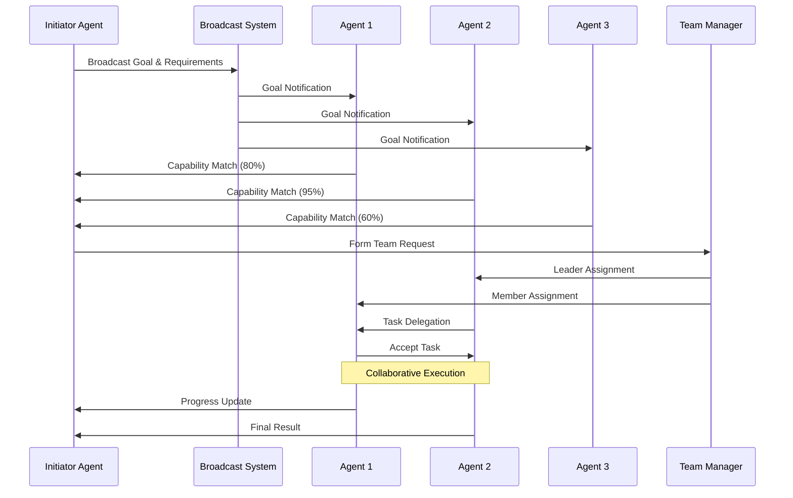

## Learning and Knowledge Sharing

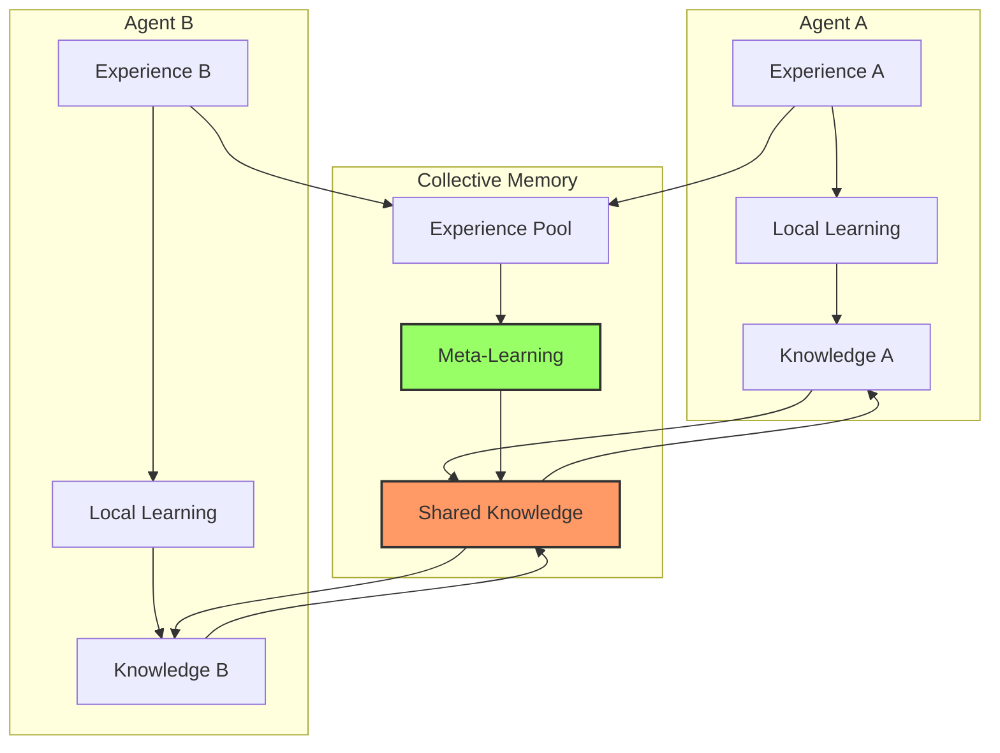

## Communication Protocol Stack

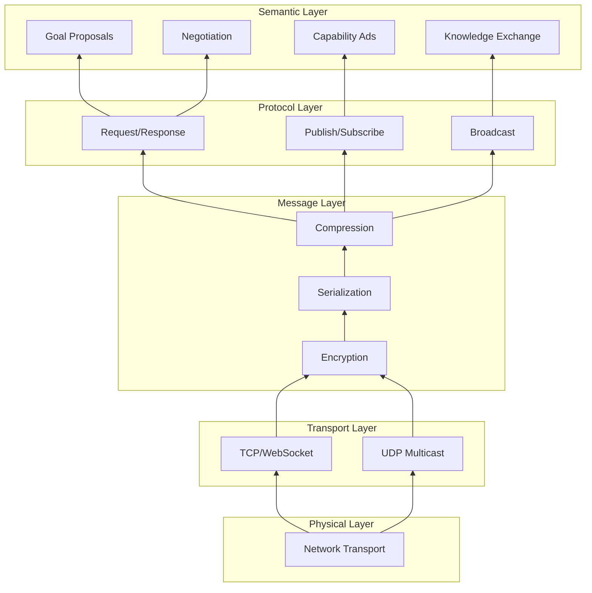

## Decision Making Process

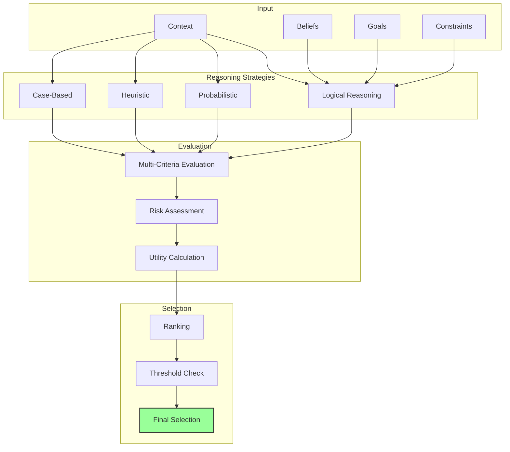

## Integration Architecture

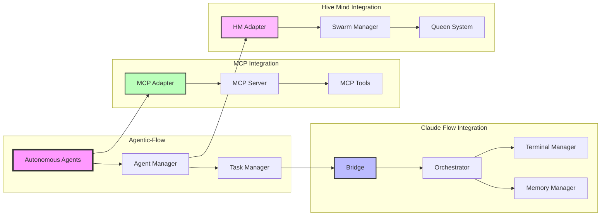

## Deployment Architecture

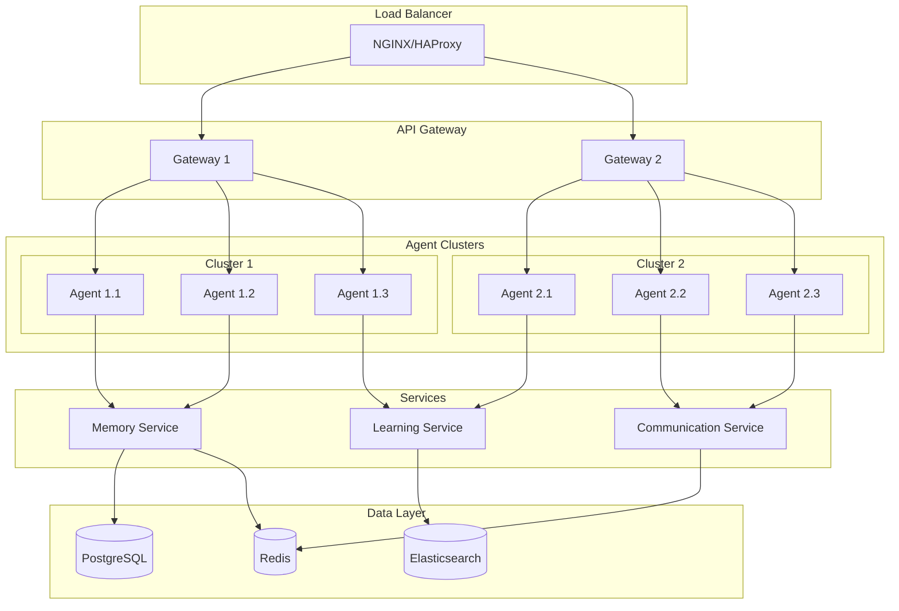

## State Transitions

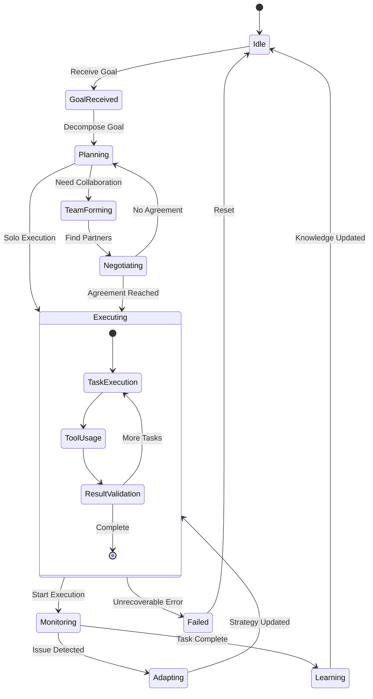

## Performance Monitoring Dashboard

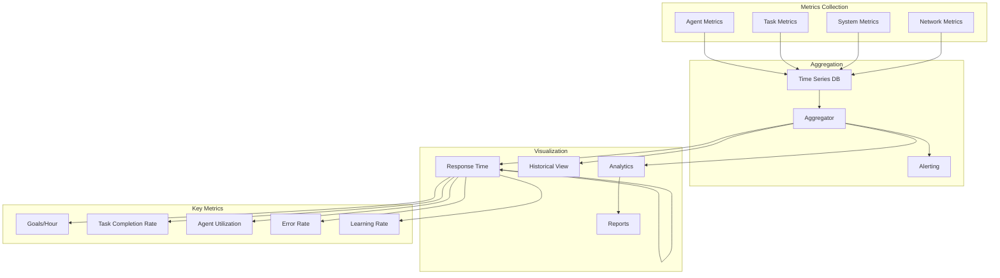

These architectural diagrams provide a comprehensive visual representation of the Agentic-Flow system, illustrating:

1. **System Overview**: High-level architecture showing all major components
2. **Agent Architecture**: Internal structure of autonomous agents
3. **Goal Decomposition**: How complex goals are broken down
4. **Team Formation**: Dynamic collaboration process
5. **Learning & Knowledge**: Collective intelligence mechanisms
6. **Communication Stack**: Protocol layers for agent interaction
7. **Decision Making**: Multi-strategy reasoning process
8. **Integration Points**: How Agentic-Flow connects with Claude Flow ecosystem
9. **Deployment**: Production architecture for scalability
10. **State Transitions**: Agent lifecycle and behavior states
11. **Performance Monitoring**: Observability and metrics collection

These diagrams serve as both documentation and implementation guides for the Agentic-Flow system.