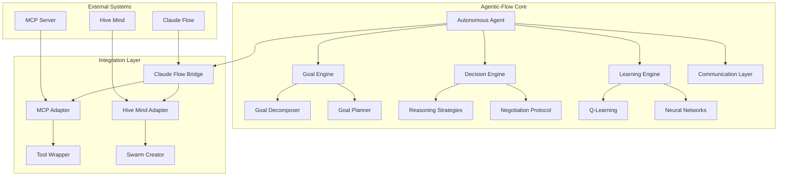

# Agentic-Flow Technical Implementation Plan

## 1. Project Structure and Architecture

### 1.1 Overview
Agentic-Flow is a next-generation autonomous agent orchestration framework that extends Claude Flow's capabilities with advanced self-organizing, goal-driven agent systems. It leverages the existing Claude Flow infrastructure while introducing new paradigms for agent autonomy, emergent behaviors, and decentralized coordination.

### 1.2 Core Architecture Principles
- **Autonomous Goal Resolution**: Agents independently determine sub-goals and strategies
- **Emergent Collaboration**: Dynamic team formation based on capabilities and goals
- **Decentralized Decision Making**: No single point of control, consensus-based actions
- **Adaptive Learning**: Agents learn from experience and share knowledge
- **Resource Optimization**: Intelligent resource allocation and load balancing

### 1.3 Directory Structure
```
agentic-flow/
├── src/
│   ├── core/
│   │   ├── agent-core.ts          # Base autonomous agent implementation
│   │   ├── goal-engine.ts         # Goal decomposition and planning
│   │   ├── belief-system.ts       # Agent belief and knowledge management
│   │   ├── decision-engine.ts     # Decision making algorithms
│   │   └── learning-engine.ts     # ML-based learning system
│   ├── behaviors/
│   │   ├── exploration.ts         # Exploratory behavior patterns
│   │   ├── collaboration.ts       # Collaborative behavior patterns
│   │   ├── optimization.ts        # Optimization behavior patterns
│   │   └── adaptation.ts          # Adaptive behavior patterns
│   ├── communication/
│   │   ├── protocol.ts            # Agent communication protocol
│   │   ├── negotiation.ts         # Contract negotiation system
│   │   ├── knowledge-sharing.ts   # Knowledge exchange protocols
│   │   └── reputation.ts          # Trust and reputation system
│   ├── coordination/
│   │   ├── team-formation.ts      # Dynamic team assembly
│   │   ├── role-assignment.ts     # Capability-based role assignment
│   │   ├── conflict-resolution.ts # Conflict resolution mechanisms
│   │   └── consensus.ts           # Distributed consensus algorithms
│   ├── goals/
│   │   ├── goal-types.ts          # Goal type definitions
│   │   ├── goal-parser.ts         # Natural language goal parsing
│   │   ├── goal-decomposer.ts     # Goal breakdown algorithms
│   │   └── goal-tracker.ts        # Goal progress tracking
│   ├── memory/
│   │   ├── episodic-memory.ts     # Experience-based memory
│   │   ├── semantic-memory.ts     # Knowledge graph memory
│   │   ├── working-memory.ts      # Short-term operational memory
│   │   └── collective-memory.ts   # Shared swarm memory
│   ├── reasoning/
│   │   ├── causal-reasoning.ts    # Cause-effect analysis
│   │   ├── probabilistic.ts       # Probabilistic reasoning
│   │   ├── temporal-reasoning.ts  # Time-based reasoning
│   │   └── spatial-reasoning.ts   # Spatial relationship reasoning
│   ├── learning/
│   │   ├── reinforcement.ts       # RL-based learning
│   │   ├── imitation.ts           # Learning from other agents
│   │   ├── transfer-learning.ts   # Knowledge transfer
│   │   └── meta-learning.ts       # Learning to learn
│   ├── integration/
│   │   ├── claude-flow-bridge.ts  # Claude Flow integration
│   │   ├── mcp-adapter.ts         # MCP tool adaptation
│   │   ├── hive-mind-adapter.ts   # Hive Mind integration
│   │   └── external-apis.ts       # External service integration
│   └── utils/
│       ├── goal-templates.ts      # Common goal patterns
│       ├── behavior-library.ts    # Reusable behaviors
│       ├── metrics.ts             # Performance metrics
│       └── visualization.ts       # Agent state visualization
├── tests/
│   ├── unit/
│   ├── integration/
│   └── e2e/
├── docs/
│   ├── architecture/
│   ├── api/
│   └── examples/
└── examples/
    ├── simple-goal/
    ├── multi-agent-collaboration/
    ├── complex-project/
    └── research-swarm/
```

## 2. Core Components and Modules

### 2.1 Autonomous Agent Core
```typescript
// agent-core.ts
interface AutonomousAgent {
  id: string;
  name: string;
  capabilities: Capability[];
  beliefs: BeliefSet;
  goals: Goal[];
  plans: Plan[];
  memory: AgentMemory;
  
  // Core methods
  perceive(environment: Environment): Perception[];
  reason(perceptions: Perception[]): Decision;
  act(decision: Decision): Action;
  learn(outcome: Outcome): void;
  communicate(message: Message): void;
}

class AgenticAgent implements AutonomousAgent {
  private goalEngine: GoalEngine;
  private decisionEngine: DecisionEngine;
  private learningEngine: LearningEngine;
  private beliefSystem: BeliefSystem;
  
  async pursue(goal: Goal): Promise<Outcome> {
    // Autonomous goal pursuit logic
    const subgoals = await this.goalEngine.decompose(goal);
    const plan = await this.createPlan(subgoals);
    return await this.executePlan(plan);
  }
  
  async collaborate(agents: AutonomousAgent[]): Promise<Team> {
    // Dynamic team formation
    const capabilities = this.assessTeamCapabilities(agents);
    const roles = this.assignRoles(capabilities);
    return new Team(agents, roles);
  }
}
```

### 2.2 Goal Engine
```typescript
// goal-engine.ts
interface Goal {
  id: string;
  description: string;
  type: GoalType;
  priority: number;
  constraints: Constraint[];
  successCriteria: Criterion[];
  deadline?: Date;
  parent?: Goal;
  children?: Goal[];
}

class GoalEngine {
  async parseGoal(input: string): Promise<Goal> {
    // NLP-based goal parsing
    const parsed = await this.nlpParser.parse(input);
    return this.createGoal(parsed);
  }
  
  async decompose(goal: Goal): Promise<Goal[]> {
    // Intelligent goal decomposition
    const strategy = this.selectDecompositionStrategy(goal);
    return await strategy.decompose(goal);
  }
  
  async planPath(from: State, to: Goal): Promise<Plan> {
    // A* or other planning algorithms
    return await this.planner.findOptimalPath(from, to);
  }
}
```

### 2.3 Decision Engine
```typescript
// decision-engine.ts
interface Decision {
  action: Action;
  confidence: number;
  reasoning: Reasoning;
  alternatives: Alternative[];
}

class DecisionEngine {
  private reasoningStrategies: ReasoningStrategy[];
  
  async decide(context: Context): Promise<Decision> {
    // Multi-strategy decision making
    const decisions = await Promise.all(
      this.reasoningStrategies.map(s => s.evaluate(context))
    );
    
    return this.combineDecisions(decisions);
  }
  
  async negotiate(proposals: Proposal[]): Promise<Agreement> {
    // Multi-agent negotiation
    const preferences = this.evaluateProposals(proposals);
    return await this.negotiationProtocol.negotiate(preferences);
  }
}
```

### 2.4 Learning Engine
```typescript
// learning-engine.ts
interface Experience {
  state: State;
  action: Action;
  outcome: Outcome;
  reward: number;
  timestamp: Date;
}

class LearningEngine {
  private qLearning: QLearning;
  private neuralNetwork: NeuralNetwork;
  private experienceBuffer: Experience[];
  
  async learn(experience: Experience): Promise<void> {
    // Store experience
    this.experienceBuffer.push(experience);
    
    // Update Q-values
    await this.qLearning.update(experience);
    
    // Train neural network periodically
    if (this.shouldTrain()) {
      await this.neuralNetwork.train(this.experienceBuffer);
    }
  }
  
  async transfer(knowledge: Knowledge, target: Agent): Promise<void> {
    // Transfer learning between agents
    const adapted = await this.adaptKnowledge(knowledge, target);
    await target.integrate(adapted);
  }
}
```

### 2.5 Communication Protocol
```typescript
// protocol.ts
interface Message {
  id: string;
  sender: AgentId;
  receivers: AgentId[];
  type: MessageType;
  content: any;
  priority: Priority;
  encryption?: boolean;
}

enum MessageType {
  GOAL_PROPOSAL = 'goal_proposal',
  CAPABILITY_ADVERTISEMENT = 'capability_advertisement',
  HELP_REQUEST = 'help_request',
  KNOWLEDGE_SHARE = 'knowledge_share',
  TEAM_FORMATION = 'team_formation',
  TASK_ASSIGNMENT = 'task_assignment',
  PROGRESS_UPDATE = 'progress_update',
  CONSENSUS_REQUEST = 'consensus_request'
}

class AgentCommunicationProtocol {
  async broadcast(message: Message): Promise<void> {
    // Efficient message broadcasting
    const relevantAgents = this.filterByRelevance(message);
    await this.send(message, relevantAgents);
  }
  
  async formContract(agents: Agent[], goal: Goal): Promise<Contract> {
    // Smart contract formation
    const terms = await this.negotiateTerms(agents, goal);
    return new Contract(terms, agents);
  }
}
```

## 3. Integration Points with Claude Flow

### 3.1 Claude Flow Bridge
```typescript
// claude-flow-bridge.ts
class ClaudeFlowBridge {
  private orchestrator: ClaudeFlowOrchestrator;
  private mcpServer: MCPServer;
  
  async adaptAgent(agenticAgent: AutonomousAgent): Promise<ClaudeFlowAgent> {
    // Convert agentic agent to Claude Flow compatible agent
    return {
      profile: this.createAgentProfile(agenticAgent),
      capabilities: this.mapCapabilities(agenticAgent.capabilities),
      handler: this.createAgentHandler(agenticAgent)
    };
  }
  
  async executeTool(tool: MCPTool, params: any): Promise<any> {
    // Execute MCP tools with agentic context
    const context = this.createToolContext();
    return await this.mcpServer.executeTool(tool, params, context);
  }
}
```

### 3.2 Hive Mind Integration
```typescript
// hive-mind-adapter.ts
class HiveMindAdapter {
  async createAutonomousSwarm(goal: Goal): Promise<HiveMind> {
    // Create Hive Mind with autonomous agents
    const config: HiveMindConfig = {
      name: `Autonomous-${goal.id}`,
      topology: 'mesh', // Best for autonomous agents
      queenMode: 'adaptive',
      autoSpawn: true,
      consensusThreshold: 0.7
    };
    
    const hiveMind = new HiveMind(config);
    await hiveMind.initialize();
    
    // Spawn autonomous agents
    const agents = await this.spawnAutonomousAgents(goal, hiveMind);
    
    return hiveMind;
  }
}
```

### 3.3 MCP Tool Adaptation
```typescript
// mcp-adapter.ts
class MCPToolAdapter {
  async wrapTool(tool: MCPTool): Promise<AutonomousTool> {
    return {
      ...tool,
      // Add autonomous execution capabilities
      autonomousExecute: async (context: AgentContext) => {
        const params = await this.inferParameters(tool, context);
        const result = await tool.handler(params);
        await this.learnFromExecution(tool, params, result);
        return result;
      }
    };
  }
}
```

## 4. Development Phases and Milestones

### Phase 1: Foundation (Weeks 1-4)
**Milestone 1.1: Core Architecture**
- [ ] Implement base AutonomousAgent class
- [ ] Create GoalEngine with basic decomposition
- [ ] Implement BeliefSystem for knowledge management
- [ ] Set up basic communication protocol
- [ ] Create initial test suite

**Milestone 1.2: Claude Flow Integration**
- [ ] Build ClaudeFlowBridge
- [ ] Adapt existing agent types
- [ ] Integrate with MCP server
- [ ] Test tool execution

### Phase 2: Intelligence (Weeks 5-8)
**Milestone 2.1: Decision Making**
- [ ] Implement DecisionEngine with multiple strategies
- [ ] Add probabilistic reasoning
- [ ] Create planning algorithms
- [ ] Implement negotiation protocols

**Milestone 2.2: Learning System**
- [ ] Build LearningEngine with Q-learning
- [ ] Add experience replay
- [ ] Implement transfer learning
- [ ] Create knowledge sharing protocols

### Phase 3: Collaboration (Weeks 9-12)
**Milestone 3.1: Team Dynamics**
- [ ] Implement dynamic team formation
- [ ] Create role assignment algorithms
- [ ] Build consensus mechanisms
- [ ] Add reputation system

**Milestone 3.2: Emergent Behaviors**
- [ ] Define behavior patterns
- [ ] Implement behavior composition
- [ ] Add adaptation mechanisms
- [ ] Create behavior library

### Phase 4: Advanced Features (Weeks 13-16)
**Milestone 4.1: Complex Reasoning**
- [ ] Add causal reasoning
- [ ] Implement temporal reasoning
- [ ] Create spatial reasoning
- [ ] Build meta-reasoning capabilities

**Milestone 4.2: Optimization**
- [ ] Implement resource optimization
- [ ] Add performance monitoring
- [ ] Create self-optimization
- [ ] Build predictive models

### Phase 5: Production Ready (Weeks 17-20)
**Milestone 5.1: Robustness**
- [ ] Add comprehensive error handling
- [ ] Implement recovery mechanisms
- [ ] Create fallback strategies
- [ ] Build monitoring dashboard

**Milestone 5.2: Documentation & Deployment**
- [ ] Complete API documentation
- [ ] Create deployment guides
- [ ] Build example projects
- [ ] Prepare release packages

## 5. Testing and Deployment Strategy

### 5.1 Testing Approach
```typescript
// Test Structure
describe('AutonomousAgent', () => {
  describe('Goal Pursuit', () => {
    it('should decompose complex goals', async () => {
      const agent = new AutonomousAgent();
      const goal = new Goal('Build a web application');
      const subgoals = await agent.decompose(goal);
      expect(subgoals).toHaveLength(greaterThan(3));
    });
    
    it('should collaborate with other agents', async () => {
      const agents = createTestSwarm(5);
      const team = await agents[0].collaborate(agents.slice(1));
      expect(team.roles).toBeDefined();
    });
  });
});
```

### 5.2 Performance Testing
```typescript
// Benchmark Suite
class AgenticFlowBenchmark {
  async benchmarkGoalCompletion(): Promise<BenchmarkResult> {
    const scenarios = [
      { agents: 1, complexity: 'simple' },
      { agents: 5, complexity: 'medium' },
      { agents: 10, complexity: 'complex' }
    ];
    
    const results = await Promise.all(
      scenarios.map(s => this.runScenario(s))
    );
    
    return this.analyzeResults(results);
  }
}
```

### 5.3 Deployment Configuration
```yaml
# docker-compose.yml
version: '3.8'
services:
  agentic-flow:
    image: agentic-flow:latest
    environment:
      - CLAUDE_API_KEY=${CLAUDE_API_KEY}
      - MAX_AGENTS=50
      - LEARNING_RATE=0.01
      - CONSENSUS_THRESHOLD=0.7
    volumes:
      - ./data:/app/data
      - ./logs:/app/logs
    ports:
      - "8080:8080"
    
  monitoring:
    image: agentic-flow-monitor:latest
    ports:
      - "3000:3000"
    depends_on:
      - agentic-flow
```

## 6. Documentation Requirements

### 6.1 API Documentation
```typescript
/**
 * @api {post} /agent/create Create Autonomous Agent
 * @apiName CreateAgent
 * @apiGroup Agent
 * 
 * @apiParam {String} name Agent name
 * @apiParam {String[]} capabilities Agent capabilities
 * @apiParam {Object} config Configuration options
 * 
 * @apiSuccess {String} id Agent ID
 * @apiSuccess {Object} agent Created agent object
 * 
 * @apiExample {curl} Example usage:
 *     curl -X POST http://localhost:8080/agent/create \
 *       -H "Content-Type: application/json" \
 *       -d '{"name": "ResearchBot", "capabilities": ["research", "analysis"]}'
 */
```

### 6.2 Architecture Diagrams



### 6.3 Example Projects

#### Simple Goal Achievement
```typescript
// examples/simple-goal/index.ts
import { AutonomousAgent, Goal } from 'agentic-flow';

async function main() {
  // Create an autonomous agent
  const agent = new AutonomousAgent({
    name: 'TaskMaster',
    capabilities: ['planning', 'execution', 'monitoring']
  });
  
  // Define a goal
  const goal = new Goal({
    description: 'Create a REST API with authentication',
    deadline: new Date(Date.now() + 7 * 24 * 60 * 60 * 1000), // 1 week
    successCriteria: [
      'API endpoints implemented',
      'Authentication working',
      'Tests passing',
      'Documentation complete'
    ]
  });
  
  // Let the agent pursue the goal autonomously
  const outcome = await agent.pursue(goal);
  
  console.log('Goal achieved:', outcome.success);
  console.log('Steps taken:', outcome.steps);
  console.log('Time taken:', outcome.duration);
}
```

#### Multi-Agent Research Project
```typescript
// examples/research-swarm/index.ts
import { createResearchSwarm } from 'agentic-flow';

async function main() {
  // Create a research swarm
  const swarm = await createResearchSwarm({
    topic: 'Quantum Computing Applications in Cryptography',
    agentCount: 8,
    researchDepth: 'comprehensive',
    outputFormat: 'academic-paper'
  });
  
  // Monitor progress
  swarm.on('progress', (update) => {
    console.log(`Progress: ${update.percentage}% - ${update.phase}`);
  });
  
  // Get results
  const research = await swarm.conduct();
  
  console.log('Research complete!');
  console.log('Papers reviewed:', research.papersReviewed);
  console.log('Key findings:', research.findings.length);
  console.log('Output saved to:', research.outputPath);
}
```

## 7. Integration Examples

### 7.1 With Existing Claude Flow Commands
```bash
# Use agentic mode with existing commands
claude-flow task "Build e-commerce platform" --agentic --autonomous

# Spawn autonomous swarm
claude-flow swarm spawn --mode agentic --goal "Optimize application performance"

# Convert existing swarm to agentic
claude-flow swarm upgrade <swarm-id> --to-agentic
```

### 7.2 Programmatic Integration
```typescript
import { ClaudeFlow } from 'claude-flow';
import { AgenticFlow } from 'agentic-flow';

// Enhance Claude Flow with agentic capabilities
const enhancedFlow = AgenticFlow.enhance(ClaudeFlow);

// Create hybrid agent
const hybridAgent = await enhancedFlow.createAgent({
  type: 'hybrid',
  baseType: 'developer',
  agenticFeatures: {
    autonomous: true,
    learning: true,
    collaborative: true
  }
});
```

## 8. Performance Considerations

### 8.1 Resource Management
- Agent spawning limits based on system resources
- Automatic garbage collection for inactive agents
- Memory pooling for efficient allocation
- CPU throttling for non-critical operations

### 8.2 Scalability
- Horizontal scaling through agent distribution
- Sharding for large knowledge bases
- Event-driven architecture for low latency
- Caching strategies for repeated operations

### 8.3 Optimization Techniques
- Lazy loading of agent capabilities
- Batch processing for communication
- Incremental learning updates
- Compressed knowledge representation

## Next Steps

1. **Repository Setup**: Create `agentic-flow` repository with initial structure
2. **Core Implementation**: Begin with AutonomousAgent and GoalEngine
3. **Integration Testing**: Verify Claude Flow compatibility
4. **Community Feedback**: Release alpha version for testing
5. **Iterative Development**: Refine based on real-world usage

This implementation plan provides a solid foundation for building Agentic-Flow as a powerful extension to Claude Flow, enabling truly autonomous agent systems while maintaining compatibility with the existing ecosystem.