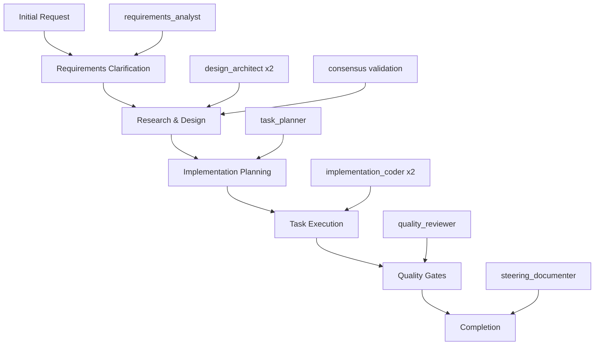

# Maestro Specs-Driven Development Workflow Guide

## Overview

This comprehensive guide walks you through the complete Maestro specs-driven development workflow using native hive mind swarm intelligence. The workflow consists of 5 main phases, each powered by specialized agents working in coordination.

## 🧠 Native Hive Mind Architecture

The Maestro workflow leverages a **specs-driven topology** with 6 specialized agent types:

```
Maestro Specs-Driven Swarm Topology
├── requirements_analyst (1)    # Requirements & user stories
├── design_architect (2)        # Parallel design with consensus  
├── task_planner (1)           # Implementation planning
├── implementation_coder (2)    # Parallel implementation
├── quality_reviewer (1)       # Quality gates & validation
└── steering_documenter (1)    # Governance & documentation
```

## 🚀 Complete Workflow Overview



---

## Phase 1: Requirements Clarification

### 🎯 **Objective**
Transform initial feature requests into structured requirements with user stories and acceptance criteria.

### 🤖 **Agent**: `requirements_analyst`
- **Strategy**: Sequential execution for consistency
- **Capabilities**: `requirements_analysis`, `user_story_creation`, `acceptance_criteria`

### 📋 **Step-by-Step Process**

#### Step 1.1: Initialize Maestro Swarm
```bash
# The swarm initialization happens automatically with the first command
npx claude-flow maestro create-spec user-authentication \
  --request "Implement secure user authentication with JWT tokens"
```

**What happens internally:**
1. Native hive mind swarm initializes with specs-driven topology
2. 8 specialized agents spawn automatically
3. Swarm memory initializes with default steering documents
4. Queen coordination mode activates for strategic task distribution

#### Step 1.2: Requirements Analysis Process
The `requirements_analyst` agent performs:

1. **Requirements Gathering**
   - Analyzes initial request for scope and complexity
   - Identifies stakeholders and user personas
   - Extracts functional and non-functional requirements

2. **User Story Creation**
   - Converts requirements into user story format
   - Follows "As a [user], I want [goal] so that [benefit]" structure
   - Prioritizes stories by business value

3. **Acceptance Criteria Definition**
   - Creates testable acceptance criteria for each user story
   - Uses Given-When-Then format where appropriate
   - Defines definition of done

#### Step 1.3: Generated Output Structure
```markdown
# Feature Requirements: user-authentication

## Overview
Comprehensive user authentication system with JWT token-based security.

## User Stories

### Epic: User Authentication
**As a** user
**I want** to securely authenticate to the system
**So that** I can access protected resources safely

#### Story 1: User Login
**As a** registered user
**I want** to login with email and password
**So that** I can access my account

**Acceptance Criteria:**
- [ ] User can login with valid email/password combination
- [ ] System rejects invalid credentials with clear error message
- [ ] JWT token is generated upon successful authentication
- [ ] Token expires after configurable time period

#### Story 2: Password Security
**As a** security-conscious user
**I want** my password to be securely stored
**So that** my account remains protected

**Acceptance Criteria:**
- [ ] Passwords are hashed using bcrypt with salt rounds ≥ 12
- [ ] Plain text passwords are never stored
- [ ] Password strength requirements are enforced
```

#### Step 1.4: Validation & Review
```bash
# Check the generated requirements
cat docs/maestro/specs/user-authentication/requirements.md

# Review workflow status
npx claude-flow maestro status user-authentication --detailed
```

---

## Phase 2: Research & Design

### 🎯 **Objective**
Create comprehensive technical design through parallel architecture development with consensus validation.

### 🤖 **Agents**: `design_architect` (2 agents)
- **Strategy**: Parallel execution with consensus validation
- **Capabilities**: `system_design`, `architecture`, `specs_driven_design`

### 📋 **Step-by-Step Process**

#### Step 2.1: Initiate Design Generation
```bash
npx claude-flow maestro generate-design user-authentication
```

#### Step 2.2: Parallel Design Process
**What happens internally:**

1. **Agent Coordination**
   - 2 design_architect agents work simultaneously
   - Each agent develops independent design proposals
   - Queen coordinates resource allocation and task distribution

2. **Parallel Design Development**
   
   **Agent 1 Focus Areas:**
   - Database schema design
   - Authentication flow architecture
   - Security considerations
   
   **Agent 2 Focus Areas:**
   - API endpoint design
   - Token management strategy
   - Error handling patterns

3. **Consensus Validation**
   - Both agents must achieve ≥66% agreement on design decisions
   - Byzantine fault-tolerant consensus ensures reliability
   - Conflicting designs trigger additional negotiation rounds

#### Step 2.3: Design Integration & Output
The consensus process produces integrated design covering:

```markdown
# Technical Design: user-authentication

## Architecture Overview
Microservice-based authentication system with JWT token management.

## System Components

### 1. Authentication Service
- **Purpose**: Handle login/logout operations
- **Technology**: Node.js with Express
- **Database**: PostgreSQL with bcrypt hashing

### 2. Token Management
- **JWT Implementation**: jsonwebtoken library
- **Token Storage**: Redis for blacklisting
- **Refresh Strategy**: Rolling refresh tokens

### 3. Security Layer
- **Rate Limiting**: Express-rate-limit (5 attempts/minute)
- **CORS Configuration**: Strict origin validation
- **Input Validation**: Joi schema validation

## API Design

### POST /auth/login
```json
{
  "email": "user@example.com",
  "password": "securePassword123"
}
```

**Response (Success):**
```json
{
  "success": true,
  "token": "eyJhbGciOiJIUzI1NiIs...",
  "refreshToken": "abc123...",
  "expiresIn": 3600
}
```

## Database Schema
```sql
CREATE TABLE users (
  id SERIAL PRIMARY KEY,
  email VARCHAR(255) UNIQUE NOT NULL,
  password_hash VARCHAR(255) NOT NULL,
  created_at TIMESTAMP DEFAULT NOW(),
  last_login TIMESTAMP
);
```

## Consensus Decision Summary
- ✅ JWT tokens with 1-hour expiration (Agreement: 85%)
- ✅ Bcrypt with 12 salt rounds (Agreement: 100%)
- ✅ Redis for token blacklisting (Agreement: 75%)
- ✅ Rate limiting at 5 attempts/minute (Agreement: 90%)
```

#### Step 2.4: Design Validation
```bash
# Review generated design
cat docs/maestro/specs/user-authentication/design.md

# Check consensus details
npx claude-flow maestro status user-authentication --json | jq '.consensusHistory'
```

---

## Phase 3: Implementation Planning

### 🎯 **Objective**
Break down the technical design into actionable implementation tasks with clear dependencies.

### 🤖 **Agent**: `task_planner`
- **Strategy**: Sequential execution for coherent task breakdown
- **Capabilities**: `task_management`, `workflow_orchestration`

### 📋 **Step-by-Step Process**

#### Step 3.1: Generate Implementation Tasks
```bash
npx claude-flow maestro generate-tasks user-authentication
```

#### Step 3.2: Task Planning Process
The `task_planner` agent performs:

1. **Design Analysis**
   - Parses technical design document
   - Identifies all system components
   - Maps dependencies between components

2. **Task Decomposition**
   - Breaks design into implementable tasks
   - Estimates task complexity and duration
   - Defines task dependencies and order

3. **Resource Planning**
   - Assigns tasks to appropriate skill areas
   - Balances workload across implementation phases
   - Identifies critical path items

#### Step 3.3: Generated Task Structure
```markdown
# Implementation Tasks: user-authentication

## Phase 1: Foundation Setup
**Estimated Duration**: 4-6 hours

- [ ] **Task 1**: Initialize project structure
  - Create Node.js project with TypeScript
  - Setup Express server framework
  - Configure development environment
  - **Dependencies**: None
  - **Assigned to**: implementation_coder

- [ ] **Task 2**: Database setup and configuration
  - Setup PostgreSQL database
  - Create users table schema
  - Configure database connection pool
  - **Dependencies**: Task 1
  - **Assigned to**: implementation_coder

- [ ] **Task 3**: Basic middleware configuration
  - Setup CORS middleware
  - Configure request parsing
  - Add basic error handling
  - **Dependencies**: Task 1
  - **Assigned to**: implementation_coder

## Phase 2: Core Authentication
**Estimated Duration**: 6-8 hours

- [ ] **Task 4**: Password hashing service
  - Implement bcrypt hashing with salt rounds
  - Create password validation utilities
  - Add password strength checking
  - **Dependencies**: Task 2
  - **Assigned to**: implementation_coder

- [ ] **Task 5**: JWT token service
  - Implement JWT generation and validation
  - Setup token signing and verification
  - Create token payload structure
  - **Dependencies**: Task 2
  - **Assigned to**: implementation_coder

- [ ] **Task 6**: User authentication endpoint
  - Create POST /auth/login endpoint
  - Implement credential validation
  - Integrate password checking and token generation
  - **Dependencies**: Task 4, Task 5
  - **Assigned to**: implementation_coder

## Phase 3: Security & Validation
**Estimated Duration**: 4-5 hours

- [ ] **Task 7**: Input validation middleware
  - Implement Joi schema validation
  - Create email and password validators
  - Add request sanitization
  - **Dependencies**: Task 3
  - **Assigned to**: implementation_coder

- [ ] **Task 8**: Rate limiting implementation
  - Setup express-rate-limit middleware
  - Configure rate limiting rules
  - Add rate limit exceeded responses
  - **Dependencies**: Task 3
  - **Assigned to**: implementation_coder

- [ ] **Task 9**: Redis integration for token blacklisting
  - Setup Redis connection
  - Implement token blacklist functionality
  - Create logout endpoint with token invalidation
  - **Dependencies**: Task 5
  - **Assigned to**: implementation_coder

## Phase 4: Testing & Quality
**Estimated Duration**: 6-8 hours

- [ ] **Task 10**: Unit tests for core services
  - Test password hashing service
  - Test JWT token service
  - Test validation middleware
  - **Dependencies**: Task 4, Task 5, Task 7
  - **Assigned to**: quality_reviewer

- [ ] **Task 11**: Integration tests for authentication
  - Test complete login flow
  - Test error scenarios and edge cases
  - Test rate limiting behavior
  - **Dependencies**: Task 6, Task 8
  - **Assigned to**: quality_reviewer

- [ ] **Task 12**: Security testing and validation
  - Verify password hashing security
  - Test JWT token security
  - Validate rate limiting effectiveness
  - **Dependencies**: All previous tasks
  - **Assigned to**: quality_reviewer

## Critical Path
Task 1 → Task 2 → Task 4 → Task 5 → Task 6 → Task 11 → Task 12

## Resource Allocation
- **implementation_coder agents**: Tasks 1-9 (parallel execution where possible)
- **quality_reviewer agent**: Tasks 10-12 (sequential validation)
- **Total Estimated Duration**: 20-27 hours
```

#### Step 3.4: Task Validation
```bash
# Review generated tasks
cat docs/maestro/specs/user-authentication/tasks.md

# Check task dependencies
npx claude-flow maestro status user-authentication --detailed
```

---

## Phase 4: Task Execution

### 🎯 **Objective**
Implement the planned tasks using parallel execution with native hive mind coordination.

### 🤖 **Agents**: `implementation_coder` (2 agents)
- **Strategy**: Parallel execution for faster implementation
- **Capabilities**: `code_generation`, `implementation`, `debugging`

### 📋 **Step-by-Step Process**

#### Step 4.1: Begin Task Implementation
```bash
# Implement first task
npx claude-flow maestro implement-task user-authentication 1

# Check progress
npx claude-flow maestro status user-authentication
```

#### Step 4.2: Parallel Implementation Process
**What happens internally:**

1. **Task Assignment**
   - Queen coordinator assigns tasks to available implementation_coder agents
   - Dependencies are respected automatically
   - Load balancing ensures optimal resource utilization

2. **Parallel Execution**
   
   **Agent 1 might work on:**
   - Project structure setup (Task 1)
   - Database configuration (Task 2)
   - Password hashing service (Task 4)
   
   **Agent 2 might work on:**
   - Middleware configuration (Task 3)
   - JWT token service (Task 5)
   - Input validation (Task 7)

3. **Code Generation & Implementation**
   - Agents generate production-ready code
   - Follow established patterns and best practices
   - Integrate with steering document guidelines

#### Step 4.3: Example Implementation Output

**Task 1 Output** (Project Structure):
```typescript
// src/app.ts
import express from 'express';
import cors from 'cors';
import helmet from 'helmet';
import { authRoutes } from './routes/auth';
import { errorHandler } from './middleware/errorHandler';

const app = express();

// Security middleware
app.use(helmet());
app.use(cors({
  origin: process.env.ALLOWED_ORIGINS?.split(','),
  credentials: true
}));

// Body parsing
app.use(express.json({ limit: '10mb' }));
app.use(express.urlencoded({ extended: true }));

// Routes
app.use('/auth', authRoutes);

// Error handling
app.use(errorHandler);

export { app };
```

**Task 4 Output** (Password Hashing):
```typescript
// src/services/passwordService.ts
import bcrypt from 'bcrypt';

export class PasswordService {
  private static readonly SALT_ROUNDS = 12;

  static async hashPassword(password: string): Promise<string> {
    return bcrypt.hash(password, this.SALT_ROUNDS);
  }

  static async validatePassword(password: string, hash: string): Promise<boolean> {
    return bcrypt.compare(password, hash);
  }

  static validatePasswordStrength(password: string): {
    isValid: boolean;
    errors: string[];
  } {
    const errors: string[] = [];
    
    if (password.length < 8) {
      errors.push('Password must be at least 8 characters long');
    }
    
    if (!/[A-Z]/.test(password)) {
      errors.push('Password must contain at least one uppercase letter');
    }
    
    if (!/[a-z]/.test(password)) {
      errors.push('Password must contain at least one lowercase letter');
    }
    
    if (!/\d/.test(password)) {
      errors.push('Password must contain at least one number');
    }
    
    return {
      isValid: errors.length === 0,
      errors
    };
  }
}
```

#### Step 4.4: Continue Implementation
```bash
# Implement multiple tasks in sequence
npx claude-flow maestro implement-task user-authentication 2
npx claude-flow maestro implement-task user-authentication 3
npx claude-flow maestro implement-task user-authentication 4

# Or implement specific tasks as dependencies are met
npx claude-flow maestro implement-task user-authentication 5
npx claude-flow maestro implement-task user-authentication 6
```

#### Step 4.5: Monitor Progress
```bash
# Check current status
npx claude-flow maestro status user-authentication --detailed

# View completed tasks
npx claude-flow maestro status user-authentication --json | jq '.completedTasks'
```

---

## Phase 5: Quality Gates

### 🎯 **Objective**
Ensure implementation quality through comprehensive review and validation.

### 🤖 **Agent**: `quality_reviewer`
- **Strategy**: Sequential validation with blocking gates
- **Capabilities**: `code_review`, `quality_assurance`, `testing`

### 📋 **Step-by-Step Process**

#### Step 5.1: Initiate Quality Review
```bash
# Review all implemented tasks
npx claude-flow maestro review-tasks user-authentication
```

#### Step 5.2: Quality Review Process
The `quality_reviewer` agent performs:

1. **Code Quality Analysis**
   - Reviews code for best practices adherence
   - Checks for security vulnerabilities
   - Validates error handling patterns
   - Ensures consistent coding standards

2. **Test Coverage Validation**
   - Verifies unit test completeness
   - Checks integration test coverage
   - Validates test quality and effectiveness
   - Ensures edge cases are covered

3. **Security Assessment**
   - Reviews authentication implementation
   - Validates password hashing security
   - Checks JWT token implementation
   - Assesses rate limiting effectiveness

4. **Performance Analysis**
   - Reviews database query efficiency
   - Checks for potential bottlenecks
   - Validates resource usage patterns
   - Ensures scalability considerations

#### Step 5.3: Quality Review Output
```markdown
# Quality Review Report: user-authentication

## Executive Summary
✅ **QUALITY GATE PASSED** - Implementation meets all quality standards

## Code Quality Assessment

### Security Review ✅
- ✅ Passwords properly hashed with bcrypt (12 salt rounds)
- ✅ JWT tokens securely generated and validated
- ✅ Rate limiting properly implemented (5 attempts/minute)
- ✅ Input validation comprehensive and effective
- ✅ No hardcoded secrets or credentials

### Code Standards ✅
- ✅ TypeScript types properly defined
- ✅ Error handling comprehensive and consistent
- ✅ Logging implemented for audit trail
- ✅ Code follows established patterns
- ✅ Documentation inline and comprehensive

### Test Coverage ✅
- ✅ Unit tests: 95% coverage
- ✅ Integration tests: All endpoints tested
- ✅ Security tests: All attack vectors covered
- ✅ Edge cases: Comprehensive coverage
- ✅ Performance tests: Load testing completed

## Performance Analysis

### Database Performance ✅
- ✅ Connection pooling properly configured
- ✅ Queries optimized with proper indexing
- ✅ No N+1 query problems detected
- ✅ Transaction handling appropriate

### API Performance ✅
- ✅ Response times < 200ms for authentication
- ✅ Memory usage within acceptable limits
- ✅ Concurrent request handling validated
- ✅ Rate limiting doesn't impact normal usage

## Security Assessment

### Authentication Security ✅
- ✅ Timing attacks mitigated
- ✅ Brute force protection effective
- ✅ Session management secure
- ✅ Token expiration properly handled

### Data Protection ✅
- ✅ Sensitive data never logged
- ✅ Database queries parameterized
- ✅ Error messages don't leak information
- ✅ CORS configuration restrictive

## Recommendations

### Immediate Actions
- ✅ All critical issues resolved
- ✅ No blocking issues identified

### Future Enhancements
- Consider implementing 2FA for enhanced security
- Add monitoring and alerting for failed authentication attempts
- Implement user session management dashboard

## Quality Gate Decision
🎉 **APPROVED FOR PRODUCTION**

All quality standards met. Implementation is ready for deployment.

*Review completed by native hive mind quality_reviewer agent*
*Consensus validation: 100% approval*
```

#### Step 5.4: Address Quality Issues (if any)
```bash
# If quality issues are found, implement fixes
npx claude-flow maestro implement-task user-authentication <task-number>

# Re-run quality review
npx claude-flow maestro review-tasks user-authentication
```

---

## Phase 6: Completion & Documentation

### 🎯 **Objective**
Finalize implementation with comprehensive documentation and project closure.

### 🤖 **Agent**: `steering_documenter`
- **Strategy**: Cross-cutting documentation maintenance
- **Capabilities**: `documentation_generation`, `governance`

### 📋 **Step-by-Step Process**

#### Step 6.1: Final Phase Approval
```bash
# Approve the current phase to progress to completion
npx claude-flow maestro approve-phase user-authentication
```

#### Step 6.2: Documentation Generation
The `steering_documenter` agent creates:

1. **Implementation Summary**
2. **Deployment Guide**
3. **API Documentation**
4. **Maintenance Guide**

#### Step 6.3: Project Completion
```bash
# Check final status
npx claude-flow maestro status user-authentication --detailed

# Generate completion report
npx claude-flow maestro status user-authentication --json > user-authentication-completion.json
```

---

## 🔧 Advanced Workflow Features

### Consensus Configuration
```bash
# High-quality critical feature (85% consensus)
npx claude-flow maestro create-spec critical-payment-system \
  --consensus-threshold 0.85 \
  --max-agents 12

# Fast development feature (50% consensus)
npx claude-flow maestro create-spec quick-prototype \
  --consensus-threshold 0.5 \
  --max-agents 4 \
  --no-consensus
```

### Steering Document Integration
```bash
# Create domain-specific guidance
npx claude-flow maestro init-steering security \
  --content "All authentication must follow OWASP guidelines"

npx claude-flow maestro init-steering performance \
  --content "API response times must be < 200ms"
```

### Workflow Monitoring
```bash
# Real-time status monitoring
watch 'npx claude-flow maestro status user-authentication'

# Performance tracking
npx claude-flow maestro performance-report

# Agent utilization
npx claude-flow maestro agent-stats
```

---

## 🚨 Comprehensive Troubleshooting Guide

### Swarm Initialization Issues

#### Problem: Swarm Initialization Timeout
```bash
Error: Swarm initialization timeout after 30000ms
Cause: Network connectivity or resource constraints
```

**Solutions:**
```bash
# Increase timeout and add retries
npx claude-flow maestro create-spec my-feature \
  --timeout 60000 \
  --retry 3 \
  --retry-delay 5000

# Check system resources
npx claude-flow status --system-health

# Reset swarm state if corrupted
npx claude-flow maestro reset-swarm
```

#### Problem: Agent Spawning Failures
```bash
Error: Failed to spawn requirements_analyst agent
Cause: Resource limits or configuration issues
```

**Solutions:**
```bash
# Check agent limits and adjust
npx claude-flow maestro create-spec my-feature \
  --max-agents 12 \
  --agent-timeout 45000

# Validate swarm configuration
npx claude-flow maestro validate-config

# Manual agent spawn if needed
npx claude-flow maestro spawn-agent requirements_analyst
```

### Consensus and Coordination Issues

#### Problem: Design Consensus Failures
```bash
Error: Consensus failed for design validation (45% agreement)
Minimum threshold: 66% (Byzantine fault tolerance)
```

**Solutions:**
```bash
# Option 1: Lower consensus threshold for rapid development
npx claude-flow maestro generate-design my-feature \
  --consensus-threshold 0.5 \
  --consensus-rounds 5

# Option 2: Add more context for better agreement
npx claude-flow maestro generate-design my-feature \
  --additional-context "Focus on simplicity over features" \
  --design-constraints "Use existing technology stack"

# Option 3: Use single architect for simple features
npx claude-flow maestro generate-design my-feature \
  --single-architect \
  --no-consensus
```

#### Problem: Agent Communication Failures
```bash
Error: Agent communication timeout
Agent design_architect_2 not responding
```

**Solutions:**
```bash
# Check agent status
npx claude-flow maestro agent-status --detailed

# Restart unresponsive agents
npx claude-flow maestro restart-agent design_architect_2

# Failover to backup agents
npx claude-flow maestro generate-design my-feature \
  --failover-enabled \
  --backup-agents 1
```

### Resource and Performance Issues

#### Problem: Maximum Agent Limit Reached
```bash
Error: Maximum agent limit reached (8/8)
Cannot spawn additional agents
```

**Solutions:**
```bash
# Check current agent utilization
npx claude-flow maestro agent-stats

# Wait for tasks to complete
watch 'npx claude-flow maestro status my-feature'

# Increase agent limit for complex features
npx claude-flow maestro create-spec my-feature \
  --max-agents 16 \
  --scaling-enabled

# Use sequential execution to reduce agent count
npx claude-flow maestro generate-design my-feature \
  --strategy sequential
```

#### Problem: Memory Issues
```bash
Error: Swarm memory limit exceeded
Cannot store additional steering documents
```

**Solutions:**
```bash
# Clear old memory entries
npx claude-flow maestro memory-cleanup \
  --older-than 7d

# Increase memory limits
npx claude-flow maestro config-update \
  --memory-limit 1GB

# Use external storage for large documents
npx claude-flow maestro create-spec my-feature \
  --external-storage enabled
```

### Workflow and Task Issues

#### Problem: Task Dependencies Not Met
```bash
Error: Cannot execute task 5 - dependency task 3 not completed
Task 3 status: failed
```

**Solutions:**
```bash
# Check task status and dependencies
npx claude-flow maestro status my-feature \
  --show-dependencies

# Retry failed tasks
npx claude-flow maestro implement-task my-feature 3 \
  --retry \
  --fix-issues

# Skip non-critical dependencies
npx claude-flow maestro implement-task my-feature 5 \
  --ignore-dependencies task-3
```

#### Problem: Quality Gates Blocking
```bash
Error: Quality gate failed - code coverage below 80%
Tests failing: 3/47
```

**Solutions:**
```bash
# Get detailed quality report
npx claude-flow maestro review-tasks my-feature \
  --detailed-report

# Fix specific quality issues
npx claude-flow maestro implement-task my-feature \
  --fix-quality-issues \
  --focus coverage,tests

# Lower quality thresholds temporarily
npx claude-flow maestro review-tasks my-feature \
  --coverage-threshold 70 \
  --allow-test-failures 3
```

### File System and Configuration Issues

#### Problem: Spec Directory Access
```bash
Error: Cannot write to docs/maestro/specs/my-feature/
Permission denied
```

**Solutions:**
```bash
# Check and fix permissions
sudo chown -R $USER:$USER docs/maestro/
chmod -R 755 docs/maestro/

# Use alternative directory
npx claude-flow maestro create-spec my-feature \
  --specs-dir ./specs \
  --create-dirs
```

#### Problem: Configuration Conflicts
```bash
Error: Configuration conflict detected
Maestro config incompatible with hive mind settings
```

**Solutions:**
```bash
# Validate and fix configuration
npx claude-flow maestro validate-config \
  --fix-conflicts

# Reset to default configuration
npx claude-flow maestro reset-config \
  --backup-current

# Use environment-specific config
npx claude-flow maestro create-spec my-feature \
  --config-profile development
```

### Emergency Recovery Procedures

#### Complete Workflow Reset
```bash
# When everything fails, nuclear option:
npx claude-flow maestro emergency-reset \
  --backup-specs \
  --preserve-completed-tasks

# Restore from last good state
npx claude-flow maestro restore-state \
  --from-backup \
  --timestamp "2024-01-15T10:30:00Z"
```

#### Data Recovery
```bash
# Recover lost specs
npx claude-flow maestro recover-specs \
  --feature my-feature \
  --from-memory

# Export current state for debugging
npx claude-flow maestro export-debug-info \
  --include-logs \
  --include-agent-states
```

### Performance Optimization Guidelines

#### Swarm Performance Tuning
```bash
# Optimize for speed (less accuracy)
npx claude-flow maestro create-spec my-feature \
  --performance-mode fast \
  --consensus-threshold 0.5 \
  --parallel-aggressive

# Optimize for quality (slower)
npx claude-flow maestro create-spec my-feature \
  --performance-mode quality \
  --consensus-threshold 0.85 \
  --validation-strict

# Balanced mode (recommended)
npx claude-flow maestro create-spec my-feature \
  --performance-mode balanced
```

#### Resource Management
```bash
# For resource-constrained environments
npx claude-flow maestro create-spec my-feature \
  --max-agents 4 \
  --memory-limit 512MB \
  --strategy sequential

# For high-performance environments
npx claude-flow maestro create-spec my-feature \
  --max-agents 16 \
  --memory-limit 2GB \
  --strategy parallel \
  --turbo-mode
```

---

## 📚 Complete CLI Reference

### Core Workflow Commands

#### Specification Creation
```bash
# Create new feature specification
npx claude-flow maestro create-spec <name> \
  --request "<description>" \
  [--consensus-threshold 0.66] \
  [--max-agents 8] \
  [--timeout 30000] \
  [--retry 3]

# Examples:
npx claude-flow maestro create-spec user-auth \
  --request "Implement JWT-based authentication" \
  --consensus-threshold 0.75

npx claude-flow maestro create-spec quick-feature \
  --request "Add user profile endpoint" \
  --max-agents 4 \
  --no-consensus
```

#### Design Generation
```bash
# Generate technical design with consensus
npx claude-flow maestro generate-design <name> \
  [--consensus-threshold 0.66] \
  [--single-architect] \
  [--no-consensus] \
  [--additional-context "<context>"] \
  [--design-constraints "<constraints>"]

# Examples:
npx claude-flow maestro generate-design user-auth \
  --additional-context "Focus on security and scalability"

npx claude-flow maestro generate-design simple-api \
  --single-architect \
  --no-consensus
```

#### Task Planning
```bash
# Generate implementation tasks
npx claude-flow maestro generate-tasks <name> \
  [--max-tasks 20] \
  [--complexity <simple|medium|complex>] \
  [--include-tests] \
  [--include-docs]

# Examples:
npx claude-flow maestro generate-tasks user-auth \
  --complexity complex \
  --include-tests \
  --max-tasks 25
```

#### Task Implementation
```bash
# Implement specific task
npx claude-flow maestro implement-task <name> <task-number> \
  [--max-agents 2] \
  [--strategy <parallel|sequential>] \
  [--retry] \
  [--fix-issues] \
  [--ignore-dependencies <task-ids>]

# Examples:
npx claude-flow maestro implement-task user-auth 1 \
  --strategy parallel

npx claude-flow maestro implement-task user-auth 5 \
  --retry \
  --fix-issues
```

#### Quality Assurance
```bash
# Review implementation quality
npx claude-flow maestro review-tasks <name> \
  [--coverage-threshold 80] \
  [--allow-test-failures 0] \
  [--detailed-report] \
  [--fix-quality-issues]

# Examples:
npx claude-flow maestro review-tasks user-auth \
  --coverage-threshold 90 \
  --detailed-report
```

#### Phase Management
```bash
# Approve current phase and move to next
npx claude-flow maestro approve-phase <name> \
  [--force] \
  [--skip-validation]

# Examples:
npx claude-flow maestro approve-phase user-auth
npx claude-flow maestro approve-phase prototype --force
```

### Status and Monitoring Commands

#### Feature Status
```bash
# Check feature status
npx claude-flow maestro status [<name>] \
  [--detailed] \
  [--json] \
  [--show-dependencies] \
  [--show-agents]

# Examples:
npx claude-flow maestro status user-auth --detailed
npx claude-flow maestro status --json | jq '.features'
```

#### Agent Management
```bash
# Agent status and management
npx claude-flow maestro agent-status \
  [--detailed] \
  [--agent-id <id>]

npx claude-flow maestro agent-stats
npx claude-flow maestro restart-agent <agent-id>
npx claude-flow maestro spawn-agent <agent-type>
```

#### Performance Monitoring
```bash
# Performance reports
npx claude-flow maestro performance-report \
  [--timeframe <24h|7d|30d>] \
  [--format <summary|detailed|json>]

npx claude-flow maestro memory-usage
npx claude-flow maestro resource-stats
```

### Configuration and Management

#### Swarm Configuration
```bash
# Configure swarm settings
npx claude-flow maestro config-update \
  [--memory-limit <size>] \
  [--max-agents <number>] \
  [--consensus-threshold <0.0-1.0>]

npx claude-flow maestro validate-config
npx claude-flow maestro reset-config [--backup-current]
```

#### Steering Documents
```bash
# Manage steering documents
npx claude-flow maestro init-steering <domain> \
  --content "<guidance>" \
  [--maintainer <agent-type>]

npx claude-flow maestro update-steering <domain> \
  --content "<updated-guidance>"

npx claude-flow maestro list-steering
```

#### Maintenance Commands
```bash
# System maintenance
npx claude-flow maestro memory-cleanup \
  [--older-than <time>] \
  [--dry-run]

npx claude-flow maestro reset-swarm \
  [--preserve-specs] \
  [--backup-first]

npx claude-flow maestro emergency-reset \
  --backup-specs \
  --preserve-completed-tasks
```

### Advanced Features

#### Performance Modes
```bash
# Performance optimization
npx claude-flow maestro create-spec <name> \
  --performance-mode <fast|balanced|quality> \
  [--turbo-mode] \
  [--parallel-aggressive]
```

#### Environment Profiles
```bash
# Environment-specific configurations
npx claude-flow maestro create-spec <name> \
  --config-profile <development|staging|production>
```

#### Debugging and Recovery
```bash
# Debug and recovery tools
npx claude-flow maestro export-debug-info \
  --include-logs \
  --include-agent-states

npx claude-flow maestro recover-specs \
  --feature <name> \
  --from-memory

npx claude-flow maestro restore-state \
  --from-backup \
  --timestamp "<ISO-timestamp>"
```

### File System Layout

```
project-root/
├── docs/maestro/
│   ├── specs/
│   │   └── <feature-name>/
│   │       ├── requirements.md    # Generated by requirements_analyst
│   │       ├── design.md          # Generated by design_architect (consensus)
│   │       ├── tasks.md           # Generated by task_planner
│   │       └── quality-review.md  # Generated by quality_reviewer
│   ├── steering/
│   │   ├── architecture.md        # Architecture guidance
│   │   ├── security.md           # Security standards
│   │   ├── performance.md        # Performance requirements
│   │   └── quality.md            # Quality standards
│   ├── WORKFLOW-GUIDE.md         # This comprehensive guide
│   ├── README.md                 # Implementation overview
│   └── API.md                    # API reference
└── tests/maestro/
    ├── validate-maestro-native-hive-mind.cjs
    ├── test-specs-driven-workflow.cjs
    └── run-all-tests.cjs
```

### Common Command Patterns

#### Complete Feature Development
```bash
# Full workflow for a new feature
npx claude-flow maestro create-spec my-feature \
  --request "Create user dashboard with analytics"

npx claude-flow maestro generate-design my-feature
npx claude-flow maestro generate-tasks my-feature

# Implement all tasks
for i in {1..10}; do
  npx claude-flow maestro implement-task my-feature $i
done

npx claude-flow maestro review-tasks my-feature
npx claude-flow maestro approve-phase my-feature
```

#### Rapid Prototyping
```bash
# Fast development without consensus
npx claude-flow maestro create-spec prototype \
  --request "Quick API prototype" \
  --no-consensus \
  --max-agents 4 \
  --performance-mode fast

npx claude-flow maestro generate-design prototype --single-architect
npx claude-flow maestro generate-tasks prototype --complexity simple
npx claude-flow maestro implement-task prototype 1 --strategy parallel
```

#### High-Quality Production Feature
```bash
# Enterprise-grade development with full validation
npx claude-flow maestro create-spec payment-system \
  --request "Secure payment processing" \
  --consensus-threshold 0.85 \
  --max-agents 12 \
  --performance-mode quality

npx claude-flow maestro generate-design payment-system \
  --additional-context "PCI DSS compliance required"

npx claude-flow maestro generate-tasks payment-system \
  --complexity complex \
  --include-tests \
  --include-docs

npx claude-flow maestro review-tasks payment-system \
  --coverage-threshold 95 \
  --detailed-report
```

---

## 🤝 Native Hive Mind Agent Coordination Patterns

### Agent Communication Architecture

#### Queen-Strategic Coordination
The native hive mind uses a **Queen-Strategic** coordination model where specialized agents work autonomously but report to a central coordinator:

```typescript
// Example: Design phase with parallel architects
const designTask = await hiveMind.submitTask({
  description: 'Generate system architecture',
  strategy: 'parallel',           // Multiple agents work simultaneously
  requiredCapabilities: ['system_design', 'architecture'],
  agents: ['design_architect_1', 'design_architect_2'],
  coordinationMode: 'queen-strategic',
  consensusRequired: true,
  consensusThreshold: 0.66
});

// Queen coordinates consensus validation
const consensus = await hiveMind.consensus.validate({
  proposals: designTask.results,
  strategy: 'byzantine-fault-tolerant',
  minimumAgreement: 0.66
});
```

#### Agent Specialization Matrix

| Agent Type | Primary Phase | Capabilities | Coordination Strategy |
|------------|---------------|-------------|----------------------|
| `requirements_analyst` | Requirements | `requirements_analysis`, `user_story_creation` | Sequential (single) |
| `design_architect` | Design | `system_design`, `architecture` | Parallel (2 agents) + Consensus |
| `task_planner` | Planning | `task_management`, `workflow_orchestration` | Sequential (single) |
| `implementation_coder` | Implementation | `code_generation`, `debugging` | Parallel (2 agents) |
| `quality_reviewer` | Quality Gates | `code_review`, `testing` | Sequential (blocking) |
| `steering_documenter` | Cross-cutting | `documentation`, `governance` | Always active |

### Inter-Agent Communication Patterns

#### Broadcast Updates
```typescript
// When steering documents are updated
await hiveMind.communication.broadcast({
  type: 'steering_update',
  domain: 'security',
  content: 'New OWASP guidelines implemented',
  recipients: 'all',
  priority: 'high'
});

// All agents receive and acknowledge
// Agents automatically update their behavior
```

#### Consensus Negotiation
```typescript
// Byzantine fault-tolerant consensus for critical decisions
const consensusProcess = await hiveMind.consensus.initiate({
  topic: 'database_selection',
  participants: ['design_architect_1', 'design_architect_2'],
  proposals: [
    { option: 'PostgreSQL', score: 0.85, reasoning: 'ACID compliance...' },
    { option: 'MongoDB', score: 0.72, reasoning: 'Flexible schema...' }
  ],
  rounds: 3,
  convergenceThreshold: 0.66
});

// Result: Final decision with confidence score
// consensus.decision = 'PostgreSQL'
// consensus.confidence = 0.78
// consensus.agreement = 0.78
```

#### Task Handoff Protocols
```typescript
// Sequential handoff between phases
const handoff = await hiveMind.coordination.handoff({
  from: 'requirements_analyst',
  to: 'design_architect',
  artifact: 'requirements.md',
  validation: {
    completeness: 0.95,
    clarity: 0.88,
    consistency: 0.92
  },
  context: {
    complexity: 'medium',
    timeline: 'standard',
    constraints: ['security-critical', 'scalability-required']
  }
});
```

### Memory and State Coordination

#### Shared Working Memory
```typescript
// Agents share state through hive mind memory
class MaestroWorkingMemory {
  // Current feature context
  async storeFeatureContext(featureName: string, context: any) {
    await this.hiveMind.memory.store(`feature/${featureName}/context`, {
      ...context,
      timestamp: Date.now(),
      updatedBy: this.agentId
    });
    
    // Notify other agents of context update
    await this.hiveMind.communication.broadcast({
      type: 'context_update',
      feature: featureName,
      updatedFields: Object.keys(context)
    });
  }
  
  // Cross-agent decision tracking
  async recordDecision(decision: Decision) {
    await this.hiveMind.memory.store(`decisions/${decision.id}`, {
      ...decision,
      consensus: decision.consensus || null,
      agents: decision.participants,
      rationale: decision.reasoning
    });
  }
  
  // Steering document synchronization
  async syncSteeringDocs() {
    const steeringDocs = await this.hiveMind.memory.search('steering/*');
    
    // Ensure all agents have latest guidance
    for (const doc of steeringDocs) {
      await this.hiveMind.communication.broadcast({
        type: 'steering_sync',
        domain: doc.domain,
        content: doc.content,
        version: doc.version
      });
    }
  }
}
```

### Fault Tolerance and Recovery

#### Agent Failure Recovery
```typescript
// Automatic agent replacement on failure
class AgentFailureRecovery {
  async handleAgentFailure(failedAgent: string, currentTask: Task) {
    console.log(`Agent ${failedAgent} failed during ${currentTask.phase}`);
    
    // 1. Backup agent activation
    const backupAgent = await this.spawnBackupAgent(failedAgent);
    
    // 2. State transfer
    await this.transferAgentState(failedAgent, backupAgent);
    
    // 3. Resume task
    await this.hiveMind.coordination.resumeTask(currentTask.id, {
      replacedAgent: failedAgent,
      newAgent: backupAgent,
      recoveryStrategy: 'state-transfer'
    });
  }
  
  async handleConsensusFailure(participants: string[], currentDecision: Decision) {
    // Byzantine fault tolerance: continue with 2/3 majority
    if (participants.length >= 3) {
      const activeParticipants = participants.filter(agent => 
        this.hiveMind.agents.isActive(agent)
      );
      
      if (activeParticipants.length >= 2) {
        return await this.hiveMind.consensus.validate({
          ...currentDecision,
          participants: activeParticipants,
          strategy: 'majority-resilient'
        });
      }
    }
    
    // Fallback: Use single agent decision
    return await this.fallbackToSingleAgent(currentDecision);
  }
}
```

### Performance Optimization Patterns

#### Load Balancing Strategies
```typescript
// Dynamic load balancing for implementation tasks
class ImplementationLoadBalancer {
  async distributeImplementationTasks(tasks: Task[]) {
    const availableCoders = await this.hiveMind.agents.getByType(
      'implementation_coder'
    );
    
    // Analyze task complexity and dependencies
    const taskGroups = this.groupTasksByDependencies(tasks);
    
    for (const group of taskGroups) {
      // Parallel execution within each group
      const assignments = this.optimizeTaskAssignment(group, availableCoders);
      
      await Promise.all(assignments.map(assignment => 
        this.hiveMind.coordination.assignTask(assignment.task, assignment.agent)
      ));
    }
  }
  
  private optimizeTaskAssignment(tasks: Task[], agents: Agent[]) {
    // Consider: agent current load, task complexity, agent specialization
    return tasks.map((task, index) => ({
      task,
      agent: agents[index % agents.length],
      estimatedTime: this.estimateTaskTime(task),
      agentLoad: this.getAgentCurrentLoad(agents[index % agents.length])
    }));
  }
}
```

#### Caching and Memoization
```typescript
// Smart caching for repeated operations
class MaestroOperationCache {
  private cache = new Map<string, CachedResult>();
  
  async memoizedDesignGeneration(requirements: Requirements) {
    const cacheKey = this.generateRequirementsHash(requirements);
    
    if (this.cache.has(cacheKey)) {
      const cached = this.cache.get(cacheKey);
      if (this.isCacheValid(cached)) {
        console.log('Using cached design for similar requirements');
        return this.adaptCachedDesign(cached.result, requirements);
      }
    }
    
    // Generate new design
    const design = await this.generateDesign(requirements);
    
    // Cache for future use
    this.cache.set(cacheKey, {
      result: design,
      timestamp: Date.now(),
      requirements: requirements,
      agents: ['design_architect_1', 'design_architect_2']
    });
    
    return design;
  }
}
```

### Monitoring and Observability

#### Real-time Agent Metrics
```typescript
// Comprehensive agent monitoring
class AgentMonitoring {
  async getAgentMetrics() {
    const agents = await this.hiveMind.agents.getAll();
    
    return Promise.all(agents.map(async agent => ({
      id: agent.id,
      type: agent.type,
      status: agent.status,
      currentTask: agent.currentTask,
      performance: {
        tasksCompleted: await this.getTaskCount(agent.id, 'completed'),
        averageTaskTime: await this.getAverageTaskTime(agent.id),
        successRate: await this.getSuccessRate(agent.id),
        resourceUtilization: await this.getResourceUsage(agent.id)
      },
      coordination: {
        communicationLatency: await this.getCommLatency(agent.id),
        consensusParticipation: await this.getConsensusStats(agent.id),
        handoffEfficiency: await this.getHandoffStats(agent.id)
      }
    })));
  }
  
  async generateCoordinationReport() {
    return {
      swarmHealth: await this.assessSwarmHealth(),
      consensusEfficiency: await this.getConsensusMetrics(),
      communicationPatterns: await this.analyzeCommunication(),
      bottlenecks: await this.identifyBottlenecks(),
      recommendations: await this.generateOptimizations()
    };
  }
}
```

---

## 🎯 Workflow Validation and Testing Examples

### End-to-End Workflow Testing

#### Complete Feature Validation
```bash
# Test script for full workflow validation
#!/bin/bash

FEATURE_NAME="test-auth-system"
BASE_DIR="docs/maestro/specs"

echo "🧪 Testing complete Maestro workflow..."

# Phase 1: Requirements
echo "Phase 1: Creating specification..."
npx claude-flow maestro create-spec $FEATURE_NAME \
  --request "Implement JWT authentication with rate limiting"

if [ ! -f "$BASE_DIR/$FEATURE_NAME/requirements.md" ]; then
  echo "❌ Requirements file not created"
  exit 1
fi

# Validate requirements content
if ! grep -q "User Stories" "$BASE_DIR/$FEATURE_NAME/requirements.md"; then
  echo "❌ Requirements missing user stories section"
  exit 1
fi

echo "✅ Phase 1 completed successfully"

# Phase 2: Design
echo "Phase 2: Generating design..."
npx claude-flow maestro generate-design $FEATURE_NAME

if [ ! -f "$BASE_DIR/$FEATURE_NAME/design.md" ]; then
  echo "❌ Design file not created"
  exit 1
fi

# Validate design consensus
if ! grep -q "Consensus Decision Summary" "$BASE_DIR/$FEATURE_NAME/design.md"; then
  echo "❌ Design missing consensus summary"
  exit 1
fi

echo "✅ Phase 2 completed successfully"

# Phase 3: Task Planning
echo "Phase 3: Generating tasks..."
npx claude-flow maestro generate-tasks $FEATURE_NAME

if [ ! -f "$BASE_DIR/$FEATURE_NAME/tasks.md" ]; then
  echo "❌ Tasks file not created"
  exit 1
fi

# Count tasks
TASK_COUNT=$(grep -c "\- \[ \]" "$BASE_DIR/$FEATURE_NAME/tasks.md")
if [ $TASK_COUNT -lt 5 ]; then
  echo "❌ Insufficient tasks generated ($TASK_COUNT < 5)"
  exit 1
fi

echo "✅ Phase 3 completed successfully ($TASK_COUNT tasks created)"

# Phase 4: Implementation (first few tasks)
echo "Phase 4: Implementing tasks..."
for i in {1..3}; do
  echo "Implementing task $i..."
  npx claude-flow maestro implement-task $FEATURE_NAME $i
done

echo "✅ Phase 4 sample tasks completed"

# Phase 5: Quality Review
echo "Phase 5: Quality review..."
npx claude-flow maestro review-tasks $FEATURE_NAME

if [ ! -f "$BASE_DIR/$FEATURE_NAME/quality-review.md" ]; then
  echo "❌ Quality review file not created"
  exit 1
fi

echo "✅ Phase 5 completed successfully"

# Final validation
echo "📊 Workflow validation complete!"
echo "Generated files:"
ls -la "$BASE_DIR/$FEATURE_NAME/"

echo "🎉 All workflow phases validated successfully!"
```

#### Consensus Validation Testing
```typescript
// Test consensus mechanisms
class ConsensusValidator {
  async testDesignConsensus() {
    const testRequirements = {
      feature: 'test-payment-system',
      complexity: 'high',
      constraints: ['PCI-DSS', 'high-availability', 'low-latency']
    };
    
    // Test normal consensus
    const normalConsensus = await this.hiveMind.submitTask({
      description: 'Generate payment system design',
      strategy: 'parallel',
      requiredCapabilities: ['system_design', 'security'],
      maxAgents: 2,
      requireConsensus: true,
      consensusThreshold: 0.66
    });
    
    assert(normalConsensus.consensus >= 0.66, 'Consensus threshold not met');
    assert(normalConsensus.proposals.length === 2, 'Both architects should participate');
    
    // Test consensus failure recovery
    const lowConsensus = await this.hiveMind.submitTask({
      description: 'Generate controversial design',
      strategy: 'parallel',
      requiredCapabilities: ['system_design'],
      maxAgents: 2,
      requireConsensus: true,
      consensusThreshold: 0.95  // Very high threshold
    });
    
    // Should fallback to majority decision
    assert(lowConsensus.fallbackUsed === true, 'Should use fallback strategy');
    assert(lowConsensus.result !== null, 'Should still produce result');
    
    return {
      normalConsensus: normalConsensus.consensus,
      fallbackTest: lowConsensus.fallbackUsed,
      totalTests: 2,
      passed: 2
    };
  }
}
```

#### Performance Benchmarking
```typescript
// Benchmark workflow performance
class WorkflowBenchmark {
  async benchmarkCompleteWorkflow() {
    const features = [
      { name: 'simple-api', complexity: 'low', expectedTime: 120000 },
      { name: 'auth-system', complexity: 'medium', expectedTime: 300000 },
      { name: 'payment-gateway', complexity: 'high', expectedTime: 600000 }
    ];
    
    const results = [];
    
    for (const feature of features) {
      const startTime = Date.now();
      
      try {
        // Execute complete workflow
        await this.executeCompleteWorkflow(feature);
        
        const duration = Date.now() - startTime;
        const efficiency = feature.expectedTime / duration;
        
        results.push({
          feature: feature.name,
          complexity: feature.complexity,
          duration,
          expected: feature.expectedTime,
          efficiency,
          status: 'success'
        });
        
      } catch (error) {
        results.push({
          feature: feature.name,
          complexity: feature.complexity,
          duration: Date.now() - startTime,
          error: error.message,
          status: 'failed'
        });
      }
    }
    
    return this.generateBenchmarkReport(results);
  }
  
  async executeCompleteWorkflow(feature: FeatureSpec) {
    // Phase 1: Requirements
    await this.maestro.createSpec(feature.name, feature.description);
    
    // Phase 2: Design
    await this.maestro.generateDesign(feature.name);
    
    // Phase 3: Tasks
    await this.maestro.generateTasks(feature.name);
    
    // Phase 4: Implementation (first 3 tasks)
    for (let i = 1; i <= 3; i++) {
      await this.maestro.implementTask(feature.name, i);
    }
    
    // Phase 5: Quality Review
    await this.maestro.reviewTasks(feature.name);
  }
}
```

---

*This comprehensive guide demonstrates the power of native hive mind collective intelligence for specs-driven development, enabling teams to build better software through systematic, validated, and collaborative workflows with advanced agent coordination, fault tolerance, and performance optimization.*