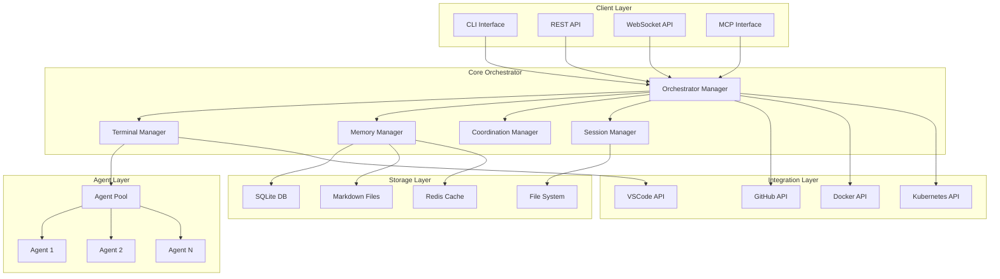
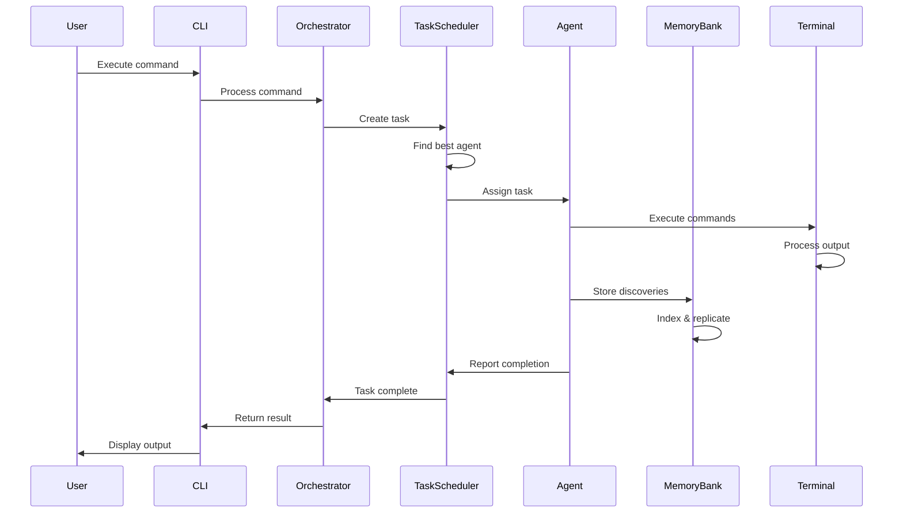

# Phase 3: Architecture Design
## Claude-Flow System Architecture

### System Overview



### Component Architecture

#### 1. Core Orchestrator Components

```typescript
// src/core/orchestrator.ts
export class Orchestrator {
    private terminalManager: TerminalManager;
    private memoryManager: MemoryManager;
    private coordinationManager: CoordinationManager;
    private sessionManager: SessionManager;
    private eventBus: EventBus;
    
    constructor(config: OrchestratorConfig) {
        this.eventBus = new EventBus();
        this.terminalManager = new TerminalManager(this.eventBus, config.terminal);
        this.memoryManager = new MemoryManager(this.eventBus, config.memory);
        this.coordinationManager = new CoordinationManager(this.eventBus, config.coordination);
        this.sessionManager = new SessionManager(this.eventBus, config.session);
    }
    
    async initialize(): Promise<void> {
        await Promise.all([
            this.terminalManager.initialize(),
            this.memoryManager.initialize(),
            this.coordinationManager.initialize(),
            this.sessionManager.initialize()
        ]);
        
        this.setupEventHandlers();
        this.startHealthMonitoring();
    }
}
```

#### 2. Terminal Management Architecture

```typescript
// src/terminal/manager.ts
export class TerminalManager {
    private pool: TerminalPool;
    private adapters: Map<Platform, TerminalAdapter>;
    private sessions: Map<string, TerminalSession>;
    
    constructor(eventBus: EventBus, config: TerminalConfig) {
        this.pool = new TerminalPool(config.poolSize);
        this.adapters = this.initializeAdapters();
        this.sessions = new Map();
    }
    
    async spawnTerminal(profile: AgentProfile): Promise<Terminal> {
        const adapter = this.selectAdapter();
        const terminal = await adapter.createTerminal(profile);
        
        const session = new TerminalSession(terminal, profile);
        this.sessions.set(session.id, session);
        
        this.eventBus.emit('terminal:spawned', { sessionId: session.id });
        return terminal;
    }
}

// Platform-specific adapters
interface TerminalAdapter {
    createTerminal(profile: AgentProfile): Promise<Terminal>;
    sendCommand(terminal: Terminal, command: string): Promise<void>;
    onOutput(terminal: Terminal, callback: OutputCallback): void;
    destroy(terminal: Terminal): Promise<void>;
}

// VSCode adapter
export class VSCodeTerminalAdapter implements TerminalAdapter {
    async createTerminal(profile: AgentProfile): Promise<Terminal> {
        if (typeof vscode !== 'undefined') {
            return vscode.window.createTerminal({
                name: profile.name,
                cwd: profile.workingDirectory,
                env: profile.environment
            });
        }
        throw new Error('VSCode API not available');
    }
}

// Native adapter for standalone mode
export class NativeTerminalAdapter implements TerminalAdapter {
    async createTerminal(profile: AgentProfile): Promise<Terminal> {
        const pty = spawn(profile.shell || getDefaultShell(), [], {
            cwd: profile.workingDirectory,
            env: { ...process.env, ...profile.environment }
        });
        
        return new NativeTerminal(pty);
    }
}
```

#### 3. Memory Bank Architecture

```typescript
// src/memory/manager.ts
export class MemoryManager {
    private storage: StorageBackend;
    private cache: CacheLayer;
    private indexer: Indexer;
    private replicator: Replicator;
    
    constructor(eventBus: EventBus, config: MemoryConfig) {
        this.storage = this.createStorageBackend(config);
        this.cache = new CacheLayer(config.cache);
        this.indexer = new Indexer(config.indexing);
        this.replicator = new Replicator(config.replication);
    }
    
    async store(key: string, value: any, metadata: Metadata): Promise<void> {
        const entry = await this.createEntry(key, value, metadata);
        
        // Write-through cache
        await this.cache.set(key, entry);
        await this.storage.put(entry);
        
        // Async indexing and replication
        this.indexer.index(entry);
        this.replicator.replicate(entry);
        
        this.eventBus.emit('memory:stored', { key, metadata });
    }
}

// Storage backend interface
interface StorageBackend {
    put(entry: MemoryEntry): Promise<void>;
    get(id: string): Promise<MemoryEntry | null>;
    query(filter: QueryFilter): Promise<MemoryEntry[]>;
    delete(id: string): Promise<void>;
}

// SQLite implementation
export class SQLiteBackend implements StorageBackend {
    private db: Database;
    
    async put(entry: MemoryEntry): Promise<void> {
        await this.db.run(`
            INSERT OR REPLACE INTO memory_entries 
            (id, key, value, metadata, vector, created_at, updated_at)
            VALUES (?, ?, ?, ?, ?, ?, ?)
        `, [
            entry.id,
            entry.key,
            JSON.stringify(entry.value),
            JSON.stringify(entry.metadata),
            entry.vector.toString(),
            entry.createdAt,
            entry.updatedAt
        ]);
    }
}

// Markdown implementation
export class MarkdownBackend implements StorageBackend {
    private basePath: string;
    
    async put(entry: MemoryEntry): Promise<void> {
        const filePath = this.getFilePath(entry.key);
        const content = this.formatAsMarkdown(entry);
        await writeFile(filePath, content);
    }
    
    private formatAsMarkdown(entry: MemoryEntry): string {
        return `# ${entry.key}

## Metadata
- ID: ${entry.id}
- Agent: ${entry.metadata.agentId}
- Timestamp: ${entry.createdAt}
- Tags: ${entry.metadata.tags.join(', ')}

## Value
\`\`\`json
${JSON.stringify(entry.value, null, 2)}
\`\`\`

## Vector Clock
${entry.vector.toString()}
`;
    }
}
```

#### 4. Coordination Architecture

```typescript
// src/coordination/manager.ts
export class CoordinationManager {
    private taskScheduler: TaskScheduler;
    private resourceManager: ResourceManager;
    private messageBus: MessageBus;
    private conflictResolver: ConflictResolver;
    
    constructor(eventBus: EventBus, config: CoordinationConfig) {
        this.taskScheduler = new TaskScheduler(config.scheduling);
        this.resourceManager = new ResourceManager(config.resources);
        this.messageBus = new MessageBus(config.messaging);
        this.conflictResolver = new ConflictResolver(config.conflicts);
    }
    
    async assignTask(task: Task): Promise<void> {
        // Check dependencies
        const ready = await this.checkDependencies(task);
        if (!ready) {
            this.taskScheduler.queue(task);
            return;
        }
        
        // Find best agent
        const agent = await this.taskScheduler.selectAgent(task);
        if (!agent) {
            this.taskScheduler.queue(task);
            return;
        }
        
        // Acquire resources
        const resources = await this.resourceManager.acquire(task.resources, agent.id);
        if (!resources) {
            this.taskScheduler.queue(task);
            return;
        }
        
        // Assign task
        await this.taskScheduler.assign(task, agent);
        this.eventBus.emit('task:assigned', { task, agent });
    }
}

// Task scheduler with advanced algorithms
export class TaskScheduler {
    private queue: PriorityQueue<Task>;
    private assignments: Map<string, Assignment>;
    private predictor: DurationPredictor;
    
    async selectAgent(task: Task): Promise<Agent | null> {
        const agents = await this.getAvailableAgents();
        
        // Score agents based on multiple factors
        const scores = agents.map(agent => ({
            agent,
            score: this.calculateScore(agent, task)
        }));
        
        // Sort by score
        scores.sort((a, b) => b.score - a.score);
        
        return scores[0]?.agent || null;
    }
    
    private calculateScore(agent: Agent, task: Task): number {
        const factors = {
            availability: agent.status === 'idle' ? 1.0 : 0.5,
            expertise: this.calculateExpertiseMatch(agent, task),
            workload: 1.0 - (agent.currentLoad / agent.maxLoad),
            performance: agent.successRate,
            affinity: this.calculateAffinity(agent, task)
        };
        
        // Weighted sum
        return factors.availability * 0.3 +
               factors.expertise * 0.25 +
               factors.workload * 0.2 +
               factors.performance * 0.15 +
               factors.affinity * 0.1;
    }
}
```

#### 5. MCP Interface Architecture

```typescript
// src/mcp/server.ts
export class MCPServer {
    private transport: MCPTransport;
    private toolRegistry: ToolRegistry;
    private sessionManager: MCPSessionManager;
    private router: RequestRouter;
    
    constructor(config: MCPConfig) {
        this.transport = this.createTransport(config.mode);
        this.toolRegistry = new ToolRegistry();
        this.sessionManager = new MCPSessionManager();
        this.router = new RequestRouter();
    }
    
    async start(): Promise<void> {
        await this.transport.start();
        this.transport.onRequest(this.handleRequest.bind(this));
    }
    
    private async handleRequest(request: MCPRequest): Promise<MCPResponse> {
        const session = this.sessionManager.getOrCreate(request.sessionId);
        
        try {
            const response = await this.router.route(request, session);
            return this.formatResponse(response);
        } catch (error) {
            return this.formatError(error);
        }
    }
}

// Transport implementations
interface MCPTransport {
    start(): Promise<void>;
    stop(): Promise<void>;
    onRequest(handler: RequestHandler): void;
    sendResponse(response: MCPResponse): Promise<void>;
}

export class StdioTransport implements MCPTransport {
    private reader: ReadlineInterface;
    
    async start(): Promise<void> {
        this.reader = createInterface({
            input: process.stdin,
            output: process.stdout
        });
        
        this.reader.on('line', this.handleLine.bind(this));
    }
    
    private handleLine(line: string): void {
        try {
            const request = JSON.parse(line);
            this.handleRequest(request);
        } catch (error) {
            this.sendError(error);
        }
    }
}

export class HttpTransport implements MCPTransport {
    private server: Server;
    
    async start(): Promise<void> {
        this.server = createServer(this.handleHttpRequest.bind(this));
        await new Promise<void>(resolve => {
            this.server.listen(this.config.port, resolve);
        });
    }
    
    private handleHttpRequest(req: IncomingMessage, res: ServerResponse): void {
        if (req.method === 'POST' && req.url === '/mcp') {
            this.handleMCPRequest(req, res);
        } else {
            res.statusCode = 404;
            res.end();
        }
    }
}
```

#### 6. Session Management Architecture

```typescript
// src/session/manager.ts
export class SessionManager {
    private sessions: Map<string, Session>;
    private persistence: SessionPersistence;
    private recovery: SessionRecovery;
    
    constructor(eventBus: EventBus, config: SessionConfig) {
        this.sessions = new Map();
        this.persistence = new SessionPersistence(config.persistence);
        this.recovery = new SessionRecovery(config.recovery);
    }
    
    async createSession(config: SessionConfig): Promise<Session> {
        const session = new Session({
            id: generateId(),
            name: config.name,
            config: config,
            agents: [],
            memory: new MemoryNamespace(config.name),
            startTime: new Date()
        });
        
        // Initialize agents
        for (let i = 0; i < config.initialAgents; i++) {
            const agent = await this.spawnAgent(session, config.agentProfile);
            session.agents.push(agent);
        }
        
        this.sessions.set(session.id, session);
        await this.persistence.save(session);
        
        return session;
    }
    
    async restoreSession(sessionId: string): Promise<Session> {
        const data = await this.persistence.load(sessionId);
        if (!data) {
            throw new Error(`Session ${sessionId} not found`);
        }
        
        const session = await this.recovery.restore(data);
        this.sessions.set(session.id, session);
        
        return session;
    }
}

// Session state and lifecycle
export class Session {
    public readonly id: string;
    public readonly name: string;
    public readonly config: SessionConfig;
    public agents: Agent[];
    public memory: MemoryNamespace;
    public readonly startTime: Date;
    public endTime?: Date;
    public status: SessionStatus;
    
    constructor(data: SessionData) {
        Object.assign(this, data);
        this.status = 'active';
    }
    
    async checkpoint(): Promise<void> {
        const snapshot = {
            id: this.id,
            name: this.name,
            config: this.config,
            agents: await this.serializeAgents(),
            memory: await this.memory.export(),
            startTime: this.startTime,
            status: this.status
        };
        
        await this.persistence.saveCheckpoint(snapshot);
    }
}
```

### Data Flow Architecture



### Deployment Architecture

#### Local Development
```yaml
# docker-compose.yml
version: '3.8'

services:
  orchestrator:
    build: .
    environment:
      - MODE=development
      - TERMINAL_MODE=native
      - MEMORY_BACKEND=sqlite
    volumes:
      - ./data:/data
      - /var/run/docker.sock:/var/run/docker.sock
    ports:
      - "8080:8080"  # API
      - "8081:8081"  # MCP HTTP
      - "9229:9229"  # Debug
      
  redis:
    image: redis:alpine
    ports:
      - "6379:6379"
```

#### Production Deployment
```yaml
# kubernetes/deployment.yaml
apiVersion: apps/v1
kind: Deployment
metadata:
  name: claude-flow-orchestrator
spec:
  replicas: 3
  selector:
    matchLabels:
      app: claude-flow
  template:
    metadata:
      labels:
        app: claude-flow
    spec:
      containers:
      - name: orchestrator
        image: claude-flow:latest
        env:
        - name: MODE
          value: production
        - name: TERMINAL_MODE
          value: kubernetes
        - name: MEMORY_BACKEND
          value: distributed
        resources:
          requests:
            memory: "1Gi"
            cpu: "500m"
          limits:
            memory: "4Gi"
            cpu: "2000m"
```

### Security Architecture

#### Authentication & Authorization
```typescript
// src/security/auth.ts
export class SecurityManager {
    private authenticator: Authenticator;
    private authorizer: Authorizer;
    private auditLogger: AuditLogger;
    
    async authenticate(credentials: Credentials): Promise<AuthToken> {
        const identity = await this.authenticator.verify(credentials);
        const token = await this.generateToken(identity);
        
        this.auditLogger.log('authentication', {
            identity: identity.id,
            timestamp: new Date(),
            result: 'success'
        });
        
        return token;
    }
    
    async authorize(token: AuthToken, resource: Resource, action: Action): Promise<boolean> {
        const identity = await this.validateToken(token);
        const allowed = await this.authorizer.check(identity, resource, action);
        
        this.auditLogger.log('authorization', {
            identity: identity.id,
            resource: resource.id,
            action: action,
            result: allowed ? 'allowed' : 'denied'
        });
        
        return allowed;
    }
}
```

#### Sandboxing
```typescript
// src/security/sandbox.ts
export class AgentSandbox {
    private permissions: Permissions;
    private resourceLimits: ResourceLimits;
    
    async execute(command: Command): Promise<Result> {
        // Validate command
        if (!this.validateCommand(command)) {
            throw new SecurityError('Command not allowed');
        }
        
        // Create sandboxed environment
        const sandbox = await this.createSandbox();
        
        try {
            // Execute with resource limits
            const result = await sandbox.execute(command, {
                timeout: this.resourceLimits.timeout,
                memory: this.resourceLimits.memory,
                cpu: this.resourceLimits.cpu
            });
            
            return result;
        } finally {
            await sandbox.destroy();
        }
    }
}
```

### Monitoring Architecture

```typescript
// src/monitoring/metrics.ts
export class MetricsCollector {
    private prometheus: PrometheusClient;
    private customMetrics: Map<string, Metric>;
    
    constructor() {
        this.setupMetrics();
    }
    
    private setupMetrics(): void {
        // System metrics
        this.customMetrics.set('agents_active', new Gauge({
            name: 'claude_flow_agents_active',
            help: 'Number of active agents'
        }));
        
        this.customMetrics.set('tasks_completed', new Counter({
            name: 'claude_flow_tasks_completed_total',
            help: 'Total number of completed tasks',
            labelNames: ['agent_id', 'task_type']
        }));
        
        this.customMetrics.set('memory_operations', new Histogram({
            name: 'claude_flow_memory_operation_duration_seconds',
            help: 'Memory operation duration',
            labelNames: ['operation_type']
        }));
        
        this.customMetrics.set('terminal_latency', new Summary({
            name: 'claude_flow_terminal_latency_seconds',
            help: 'Terminal command latency',
            percentiles: [0.5, 0.9, 0.95, 0.99]
        }));
    }
}
```

### Extension Points

#### Plugin Architecture
```typescript
// src/plugins/plugin.ts
export interface Plugin {
    name: string;
    version: string;
    initialize(context: PluginContext): Promise<void>;
    shutdown(): Promise<void>;
}

export class PluginManager {
    private plugins: Map<string, Plugin>;
    private context: PluginContext;
    
    async loadPlugin(path: string): Promise<void> {
        const module = await import(path);
        const plugin = new module.default() as Plugin;
        
        await plugin.initialize(this.context);
        this.plugins.set(plugin.name, plugin);
    }
}

// Example plugin
export class GitHubIntegrationPlugin implements Plugin {
    name = 'github-integration';
    version = '1.0.0';
    
    async initialize(context: PluginContext): Promise<void> {
        context.registerTool({
            name: 'github_pr_create',
            description: 'Create a GitHub pull request',
            handler: this.createPullRequest.bind(this)
        });
    }
    
    private async createPullRequest(params: any): Promise<any> {
        // Implementation
    }
}
```

---
*Phase 3 Status: Complete*
*Last Updated: 2025-01-06*