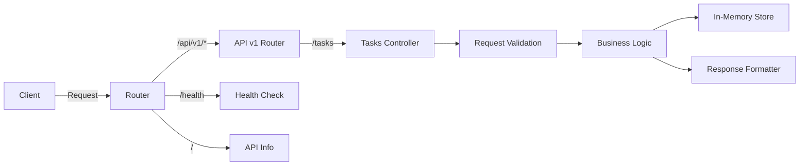
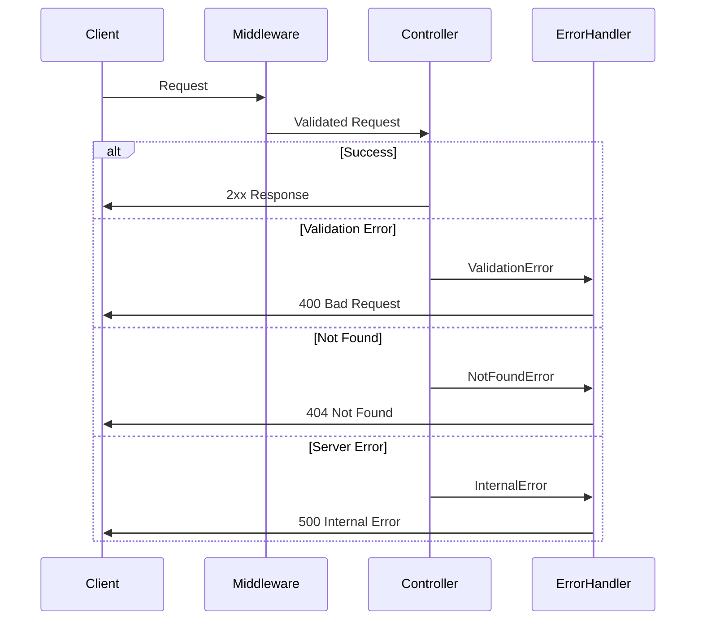
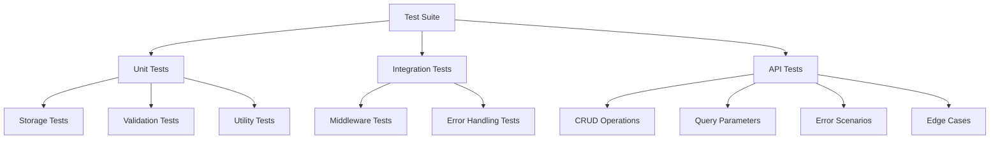
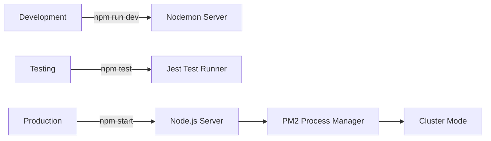

# REST API Completion Architecture Plan

## Current State Analysis

The REST API project has a mismatch between implementation and specification:
- **Implementation**: Uses "items" resource at `/api/items`
- **Specification**: Defines "tasks" resource at `/api/v1/tasks`

## Architecture Alignment Strategy

### 1. Resource Migration Architecture

```mermaid
graph TD
    A[Current: Items API] -->|Refactor| B[Target: Tasks API v1]
    
    subgraph "Current Implementation"
        A1[/api/items] --> A2[{id, name, description}]
        A1 --> A3[In-memory storage]
    end
    
    subgraph "Target Implementation"
        B1[/api/v1/tasks] --> B2[{id, title, description, completed, createdAt, updatedAt}]
        B1 --> B3[Enhanced in-memory storage]
        B1 --> B4[Query parameters]
        B1 --> B5[Proper error handling]
    end
```

### 2. API Version Architecture



### 3. Data Model Architecture

```typescript
interface Task {
    id: string;              // UUID format
    title: string;           // Required, max 200 chars
    description: string;     // Optional, max 1000 chars
    completed: boolean;      // Default: false
    createdAt: string;       // ISO 8601 timestamp
    updatedAt: string;       // ISO 8601 timestamp
}

interface TaskStore {
    tasks: Map<string, Task>;
    create(task: Partial<Task>): Task;
    findAll(filters?: TaskFilters): Task[];
    findById(id: string): Task | null;
    update(id: string, updates: Partial<Task>): Task | null;
    delete(id: string): boolean;
}
```

### 4. Error Handling Architecture



### 5. Component Responsibilities

#### Server Component (`server.js`)
- Express app initialization
- Middleware configuration
- Route registration
- Error handling setup
- Server startup

#### Routes Component
- API versioning router
- Task routes definition
- Request parameter extraction
- Response formatting

#### Controllers Component
- Business logic execution
- Data validation
- Store interaction
- Error throwing

#### Storage Component
- In-memory data persistence
- CRUD operations
- Query filtering
- Data transformation

#### Middleware Component
- Request validation
- Error handling
- Request ID generation
- Response headers

### 6. Testing Architecture



### 7. Security Architecture

- **Input Validation**: All inputs sanitized and validated
- **Error Information**: No sensitive data in error responses
- **Rate Limiting**: Consider for production (not in MVP)
- **CORS**: Configured appropriately
- **Headers**: Security headers (helmet.js for production)

### 8. Configuration Architecture

```javascript
const config = {
    server: {
        port: process.env.PORT || 3000,
        host: process.env.HOST || 'localhost'
    },
    api: {
        version: 'v1',
        basePath: '/api',
        pagination: {
            defaultLimit: 10,
            maxLimit: 100
        }
    },
    storage: {
        type: 'memory',
        seedData: true
    }
};
```

### 9. Deployment Architecture



### 10. File Structure Architecture

```
rest-api-simple/
├── server.js                 # Main application file
├── server.test.js           # Comprehensive test suite
├── package.json             # Dependencies and scripts
├── .gitignore              # Git ignore file
├── README.md               # User documentation
├── api-specification.md    # API specification
├── architecture.md         # System architecture
├── implementation-plan.md  # SPARC execution plan
└── test-api.js            # Manual testing script
```

## Implementation Phases

### Phase 1: Refactor Core Structure
1. Rename `index.js` to `server.js`
2. Update resource from "items" to "tasks"
3. Implement API versioning structure
4. Update data model with timestamps

### Phase 2: Feature Implementation
1. Add query parameter support
2. Implement proper error handling
3. Add request validation
4. Implement filtering and pagination

### Phase 3: Testing and Documentation
1. Install Jest and Supertest
2. Create comprehensive test suite
3. Update documentation to match implementation
4. Add API usage examples

### Phase 4: Quality Assurance
1. Code review and refactoring
2. Performance optimization
3. Security review
4. Final documentation update

## Next SPARC Mode Assignments

1. **code mode**: Refactor server.js with new architecture
2. **tdd mode**: Create test suite with Jest/Supertest
3. **refinement-optimization-mode**: Optimize query performance
4. **security-review mode**: Validate input handling and error responses
5. **docs-writer mode**: Update README and API documentation

## Key Design Decisions

1. **Modular but Simple**: Keep single-file architecture for simplicity while maintaining clear separation of concerns through functions
2. **In-Memory Storage**: Maintain simplicity while adding proper filtering and query capabilities
3. **RESTful Standards**: Follow REST conventions strictly with proper HTTP methods and status codes
4. **Error Consistency**: Uniform error response format across all endpoints
5. **Test Coverage**: Aim for 100% test coverage with both unit and integration tests

## Success Criteria

- [ ] All endpoints match `/api/v1/tasks` specification
- [ ] Task model includes all required fields
- [ ] Query parameters work correctly
- [ ] Comprehensive test suite passes
- [ ] Documentation accurate and complete
- [ ] No hardcoded values or secrets
- [ ] Clean, maintainable code under 500 lines