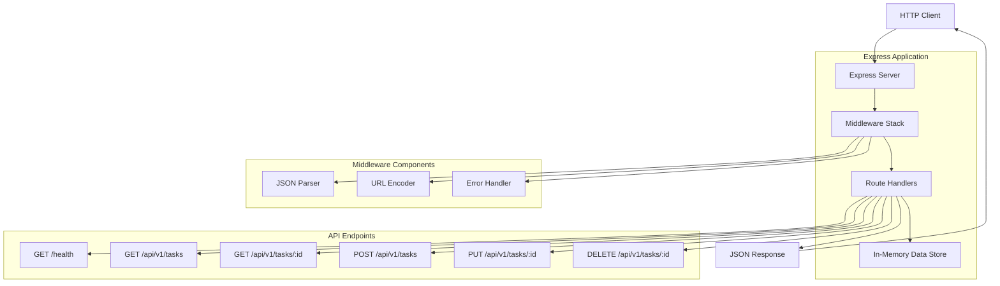
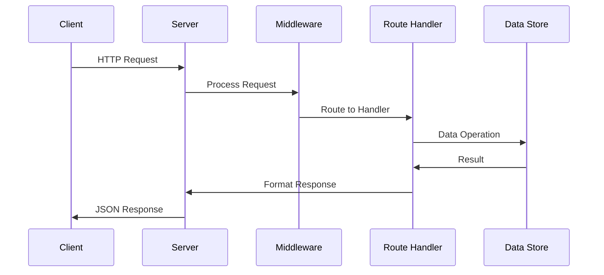

# Simple REST API Architecture

## System Overview

This is a minimalist REST API designed to demonstrate basic CRUD operations with a clean, simple architecture that can be understood and extended easily.

### Architecture Diagram



## Component Architecture

### 1. Express Server (server.js)
- **Responsibility**: HTTP server initialization and middleware configuration
- **Port**: Configurable via PORT environment variable (default: 3000)
- **Middleware**: Minimal stack with JSON parsing and error handling

### 2. Route Handlers
- **Responsibility**: Process HTTP requests and return appropriate responses
- **Pattern**: RESTful resource-based routing
- **Error Handling**: Centralized error middleware

### 3. In-Memory Data Store
- **Responsibility**: Simple data persistence during server runtime
- **Structure**: Array of objects with auto-incrementing IDs
- **Limitations**: Data is lost on server restart (by design for simplicity)

## API Design Principles

### RESTful Conventions
- Resource-based URLs (`/api/v1/tasks`)
- HTTP methods for operations (GET, POST, PUT, DELETE)
- JSON request/response format
- Proper HTTP status codes

### Simplicity First
- Single file implementation
- No external dependencies beyond Express
- No authentication or authorization
- No database complexity
- Clear, readable code structure

### Extensibility Points
- Easy to add new resources
- Simple to integrate authentication later
- Database can replace in-memory store
- Middleware stack is expandable

## Data Flow



## Security Considerations

### Current State (Simple API)
- No authentication implemented
- No input validation beyond basic type checking
- No rate limiting
- Suitable for development/learning only

### Future Security Enhancements
- Add JWT authentication
- Implement input validation (Joi/express-validator)
- Add rate limiting middleware
- Use HTTPS in production
- Implement CORS properly

## Performance Characteristics

### Current Design
- **Latency**: Minimal (in-memory operations)
- **Throughput**: Limited by single process
- **Scalability**: Vertical only (single instance)
- **Memory**: Grows with data (no persistence)

### Optimization Opportunities
- Add caching layer (Redis)
- Implement database for persistence
- Use clustering for multi-core utilization
- Add compression middleware
- Implement pagination for large datasets

## Error Handling Strategy

```javascript
// Centralized error handling pattern
app.use((err, req, res, next) => {
  const status = err.status || 500;
  const message = err.message || 'Internal server error';
  
  res.status(status).json({
    error: {
      message,
      status,
      timestamp: new Date().toISOString()
    }
  });
});
```

## Testing Architecture

### Unit Tests
- Test individual route handlers
- Mock Express request/response objects
- Verify data transformations

### Integration Tests
- Test full request/response cycle
- Verify HTTP status codes
- Check response formats
- Test error scenarios

### Test Stack
- Jest for test runner
- Supertest for HTTP testing
- No mocking required (simple architecture)

## Deployment Considerations

### Development
```bash
npm install
npm run dev  # Uses nodemon for auto-reload
```

### Production
```bash
npm install --production
npm start
```

### Environment Variables
- `PORT`: Server port (default: 3000)
- `NODE_ENV`: Environment (development/production)

## Module Boundaries

### Current Structure (Simple)
```
rest-api-simple/
├── server.js         # All application logic
├── package.json      # Dependencies and scripts
├── server.test.js    # Test suite
└── README.md         # User documentation
```

### Future Modular Structure
```
rest-api-simple/
├── src/
│   ├── routes/       # Route definitions
│   ├── middleware/   # Custom middleware
│   ├── models/       # Data models
│   └── utils/        # Helper functions
├── tests/            # Test files
└── config/           # Configuration
```

## Technology Decisions

### Why Express.js?
- Minimal and flexible
- Large ecosystem
- Well-documented
- Easy to learn
- Production-proven

### Why In-Memory Storage?
- Zero configuration
- Perfect for demos/learning
- Fast development cycle
- No external dependencies
- Easy to understand

### Why No Authentication?
- Reduces complexity
- Focuses on core REST concepts
- Easier to test and debug
- Can be added incrementally

## Next Steps

1. Implement basic server structure
2. Add CRUD endpoints for tasks
3. Create comprehensive tests
4. Write user documentation
5. Add example requests/responses